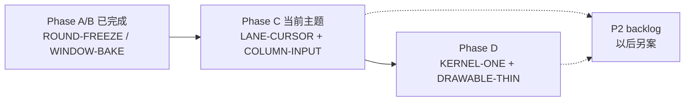

# Mania 高 KPS 判定性能 — 代号 backlog

> **定位**：高密度谱面 / 高按键吞吐（社区口径可达 ~90 KPS 量级）下的**全 HitMode**热路径优化清单。  
> **与主题关系**：依附「局内冻结判定平面」主线（`ManiaJudgementRound` → `ManiaLaneController` → `ManiaJudgementKernel`），**不**替代架构重构；本文件只记录性能专项，方案细节以后单独开文档。  
> **黄金标准不变**：任何优化不得破坏 `TestSceneReplaySessionParity` / `ManiaCrossSourceInvariantTest`。

---

## 已落地（主线 Phase A/B，全模式受益）

| 代号 | 内容 | 受益 HitMode |
|------|------|----------------|
| **ROUND-FREEZE** | `ManiaJudgementRound` 开局冻结 env / strategy / flags | 全部 Ez |
| **ENV-ONE** | `ResolveEnvironment(purpose, score?, offset?)` 统一解析 | 全部 |
| **WINDOW-BAKE** | `ManiaWindowBaker.Align` 开局对齐 HitMode + 非 O2 窗口 | 全部 Ez + Session |
| **O2-NOMUTATE** | O2 用户判定走 `ResultFor(bpm)`，去掉 per-note `updateWindows()` | O2Jam |
| **O2-FRAME-BPM** | auto-miss 同帧共享一次 `GetBPMAtTime` | O2Jam |

---

## 待办（按优先级，全 HitMode 视角）

### P0 — 与主线 Phase C 绑定（高 KPS 主瓶颈）

| 代号 | TODO | 涉及 HitMode | 说明 |
|------|------|----------------|------|
| **LANE-CURSOR** | [ ] 实现 `ManiaLaneController`：列内目标序列 + 游标，替代 `OrderedHitPolicyHelper` 每次 `OnPressed` 扫 `AliveObjects` | **全部**（Earliest 先落地；Combo/Duration 次之） | Session 已有 `ManiaColumnSimulator` 思路；Drawable 列级共用。90 KPS 下 note-lock 扫描通常为最大单项开销。 |
| **COLUMN-INPUT** | [ ] 按键入口收敛到 `Column.OnPressed`：`selectTarget` → 单 drawable `UpdateResult`；减少冒泡链上重复 `CheckHittable` | **全部** | 与 **LANE-CURSOR** 同批交付。 |
| **POLICY-PARITY** | [ ] Earliest / Combo / Duration 三路 Drawable ≡ Session 回归测试补齐 | BMS 尤甚 | 重构 note-lock 前的安全网。 |

### P1 — 与主线 Phase D 绑定（正确性 + 间接减负）

| 代号 | TODO | 涉及 HitMode | 说明 |
|------|------|----------------|------|
| **KERNEL-ONE** | [ ] `ManiaJudgementKernel`：合并 `EvaluateDrawable*` / `EvaluateSession*` 为单一 `EvaluatePress` / `EvaluateTail` | 全部 Ez | 减少热路径分支与重复上下文构造；Session/Drawable 单源利于后续 profile。 |
| **DRAWABLE-THIN** | [ ] Drawable `CheckForResult` 收敛为：`offset → kernel → ApplyResult` | 全部 Ez | 降低每 note OOP 层数。 |
| **STATE-ONE** | [ ] O2 Pill / BMS KPoor 路由状态统一进 `ManiaReplayJudgementState`（去掉 gameplay 静态 `O2HitModeExtension` 计数） | O2 + BMS | 正确性为主；顺带减少 `ConditionalWeakTable` 查找。 |

### P2 — 高 KPS 专项（可独立于 Phase C/D 排期，**以后另写方案**）

| 代号 | TODO | 涉及 HitMode | 说明 |
|------|------|----------------|------|
| **AUTO-MISS-GATE** | [ ] 每帧 `UpdateResult(false)`：用烘焙 miss 窗早退，未进窗的存活物件跳过 Ez 判定链 | 全部 Ez | 存活 note 数 × 帧率；与按键 KPS 无关但高密度谱面极重。 |
| **O2-PILL-1PASS** | [ ] `PillCheck` 接受已算 `bpm` 或 `GetRanges` 结果，去掉每次 press 3× `GetBPMAtTime` | O2Jam | Phase B 遗留；Pill 开时按键路径可能劣于旧实现。 |
| **O2-COLUMN-BPM** | [ ] `NotifyO2InputAt` 挪到 `Column.OnPressed`（每列每按键 1 次） | O2Jam | 当前在 drawable `CheckForResult` 内，和弦同帧可能重复查表。 |
| **BMS-ROUTE-COL** | [ ] BMS `BmsRouteState` 按列持有，避免 per-note `ConditionalWeakTable` | BMS | 高叠键列上 post-Bad KPoor 状态机。 |
| **HOLD-TAIL-FAST** | [ ] Hold/Tail 释放判定：列级 holding 状态 + 单 target，避免 tail drawable 全链 `CheckForResult` | EZ2AC / Malody / O2 LN | LN 高 KPS 谱面次要热点。 |
| **SOUND-DECOUPLE** | [ ] 评估 `Column.OnPressed` 音效与判定解耦（判定先走、音效异步/合并） | 全部 | 仅当 profile 证明音效阻塞输入时做；**不在架构重构前动**。 |

### P3 — 观测与验收（排期前建议先做）

| 代号 | TODO | 说明 |
|------|------|------|
| **BENCH-KPS** | [ ] 扩展 `BenchmarkManiaReplaySession` + 新增 Drawable 侧 micro-bench（note-lock / O2 press / auto-miss） | 用数据定 P2 顺序，避免凭感觉优化。 |
| **TRACE-JUDGE** | [ ] 复用 `EzJudgmentDiagnostics` 或轻量计数器：每帧 `IsHittable` 次数、`CheckForResult` 次数、BPM 查表次数 | 90 KPS 实机对比 Phase A/B 前后。 |

---

## 明确不在本 backlog 内（别和主题搅在一起）

- 游戏中禁止改 HitMode/HealthMode 的 **UX**（产品层，非性能层）。
- Lazer/Classic `Lazer*Replica` 与 ppy inline 合并（ppy 同步成本）。
- `OffsetPlusMania` Realm 持久化（见 `REPLAY_JUDGE_MERGE.md` §1.5d follow-up）。
- 单纯「禁止游戏中修改设置」的配置锁 UI。

---

## 主线阶段对照（继续专注主题时走这条）

**下一步默认**：推进 **Phase C（LANE-CURSOR）**，P2 代号项仅在 profile 或 parity 需求明确时插入。

---

## 修订记录

| 日期 | 说明 |
|------|------|
| 2026-07-06 | 初版：全 HitMode 高 KPS backlog；Phase A/B 已落地项归档 |
