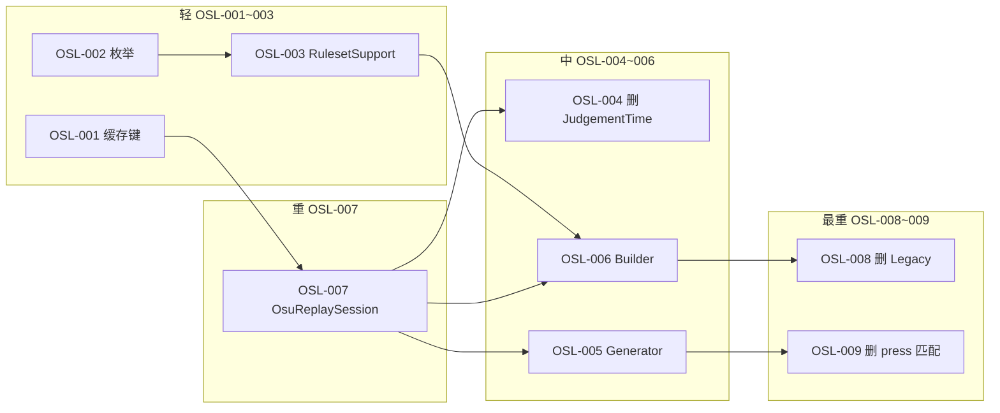

# EZ-SR-TL 注册表（Session / Timeline / Race）

Score Race Timeline 架构的**唯一权威文档**。代码中 `TODO(EZ-SR-TL-*)` 与 `TODO(EZ-SR-OSL-*)` 须与本表同步维护。

相关深文档：

- Mania Session 黄金标准：[REPLAY_JUDGE_MERGE.md](../../../osu.Game.Rulesets.Mania/EzMania/ReplayJudge/REPLAY_JUDGE_MERGE.md)
- Wiki：[时间线服务](https://github.com/SK-la/Ez2Lazer/wiki/时间线服务-中文) · [角逐服务](https://github.com/SK-la/Ez2Lazer/wiki/角逐服务-中文)

---

## §1 原则

1. **Statistics 不可被 Session 覆盖** — Realm 的 Statistics / Acc / TotalScore 为权威；Session 只 patch 内存 HitEvents 或供 Graph Now 读取，禁止写回 Statistics。
2. **同 score+env 只仿真一遍** — Score / Timeline / HitEvents 是同次 replay 仿真的多出口；消除 Service 层双倍 `Run`+`RunTimeline`（TL-026）。Mania **禁止 F 类**（非 replay 产出的 HitEvents 喂 SP 建 Timeline）。
3. **StatisticsPanel 与 Graph Now 基线共享 Session cache** — 同一 `score + env` 一次 `Run`；Graph offset 的 C/D 分层不污染 base cache。
4. **HitEvents 不持久化** — 补 HitEvents = 读同一 Run 的 HitEvents 子集。

---

## §1.5 执行模型（一遍 SP · 多出口）

### 规则集层（Mania 已实现）

`ManiaReplaySession.run(..., recordTimeline)` — replay → ApplyResult →（可选）Timeline 快照 → PopulateScore。

| API | 出口 | SP 仿真遍数 |
|-----|------|------------|
| `Run` | 完整 Score | 1 |
| `RunTimeline` | EzScoreTimeline | 1 |
| `RunHitEvents` | HitEvents（= Run） | 1 |

### Service 层（TL-026 已完成）

| 调用 | 仿真遍数 | 说明 |
|------|-------------|------|
| `RunCombinedAsyncFunc` / `RunRequestAsync` | **1** | `RunWithTimeline` 多出口 |
| 同 score+env 的 `RunAsync` + `RunTimelineAsync` | **1** | 共享 `sessionRunCache` |

角逐 Builder 使用 `IEzReplaySession.RunTimelineDirectAsync`（不经 TimelineCache）。

### 共享 cache 与 Graph offset（§1.6a）

| 消费方 | 读法 | Cache |
|--------|------|-------|
| StatisticsPanel 补 HitEvents | HitEvents 子集 | score+env base |
| Graph Now 基线 | 完整 Score | 同上 |
| Graph offset 拖动（C） | RefreshDisplayOnly | 无 Session |
| Graph offset 落定（D） | RefreshFromService | 新 env → 新 key |

### 「第二遍」场景对照（§1.6b）

| 代号 | 场景 | Plan 态度 |
|------|------|-----------|
| **C** | Graph 拖 offset，UI 预览 | ✓ 合法 |
| **D** | offset debounce 后精确 Session | ✓ 合法 |
| **E** | Mania 用 Session HitEvents 再 `buildFromHitEvents` | ✗ 文档禁令（无代码路径） |
| **F** | Osu generator → `buildFromHitEvents` | OSU-TRANSITIONAL |

---

## §1.7 分析定稿（只读，2026-07）

本节固化架构讨论结论，避免后续阶段重复梳理。§1.5 表格为摘要；此处补「为什么」。

### 1.7a 什么叫多余计算

| 调用 | 是否浪费 | 说明 |
|------|----------|------|
| 只调 `Run` | 否 | 出口为 Score/HitEvents/Statistics |
| 只调 `RunTimeline` / `RunTimelineDirectAsync` | 否 | 出口为 Timeline；内部仍完整 replay 仿真，**不是**「少算了一截」 |
| 同 score+env 先 `Run` 再 `RunTimeline` 各一遍 | **是** | 同输入同 env，结果应对齐 → 第二遍纯浪费（TL-026 已用 `RunWithTimeline` + `sessionRunCache` 消除） |
| Graph offset 拖动（C） | 否 | 不跑 Session，UI 层平移已有 HitEvents |
| Graph offset 落定（D） | 否 | **新 env**（含 committed offset）→ 新 cache key，合理的精确二次 Session |

**定音**：要优化的是「同 key 双倍完整仿真」，不是否定 `RunTimeline` 单次成本。

### 1.7b ForStored / ForLive 与 cache key

环境由 `ReplayRunPurpose` + `ResolveForReplay(score, purpose)` 解析。**Purpose 不同 → env 不同 → cache key 不同**；不强行合并，但各自 key 内仍须一遍 SP 多出口。

| 消费方 | Purpose | env 语义 | 与谁可共 cache |
|--------|---------|----------|----------------|
| StatisticsPanel 补 HitEvents | ForStored | 成绩嵌入 HitMode/HealthMode（有则 FromScore） | 同 score、同 ForStored 解析结果的 Graph/Panel |
| Graph Now 基线 | ForLive | 当前全局 HitMode/HealthMode 等 | 同 score、同 ForLive 的 `RunAsync` / `RunRequestAsync` |
| 角逐 ghost Timeline | ForLive | 与 HUD 一致，**不**读成绩嵌入 HitMode | 同 score+ForLive 的 Graph Now（若同时需要 Score+Timeline，走 `RunRequestAsync` 一次） |
| Graph offset 落定（D） | ForLive | env 含 offset → **新 key** | 不与 base ForLive 共用 |

### 1.7c 共出口分组（Mania，已实现）

同一 `score + 解析后 environment` → `sessionRunCache` 一条目 → `RunWithTimeline` 一次仿真 → 多出口：

| 出口 | 典型消费方 |
|------|------------|
| `Score`（含 HitEvents、Statistics） | Graph Now、`RunAsync` |
| `EzScoreTimeline` | `RunTimelineAsync`、`RunTimelineDirectAsync`（角逐 Builder，不经 TimelineCache） |
| `ReplayRunResult`（Score + Timeline） | `RunRequestAsync(ForLive)`（Graph TL-024） |

**读法差异，不是算法差异**：StatisticsPanel 只 patch `HitEvents` 子集；Graph 读完整 `Score`；Race 读 `Timeline.QueryAtTime`——三者可共享底层 Run，**禁止**为不同出口各跑一遍仿真。

**Osu**：无 Session；角逐 F 类 legacy 不参与 `sessionRunCache`（generator → `buildFromHitEvents`，非 replay 一遍视图）。

### 1.7d C / D / E / F 易混澄清

| 代号 | 是什么 | 是不是工作项 |
|------|--------|--------------|
| **C** | Graph 拖 offset → `RefreshDisplayOnly` | 已实现 UX，本 epic 不改 |
| **D** | offset debounce → `RefreshFromService` | 已实现，新 env 精确 Session |
| **E** | Mania 已有 Session 输出，却再 `buildFromHitEvents` 建 Timeline | **否** — 仅文档禁令；Mania 必须用 `RunTimeline` / `RunWithTimeline` |
| **F** | Osu：`OsuScoreHitEventGenerator` → legacy 喂 SP | **是过渡** — Phase 3 OSL-007 后 OSL-008 删除 |

**Graph 改 offset = C/D，与 E/F 无关。** PR-B 把 legacy **只留给 Osu** 即落实「Mania 禁止 F 类」。

### 1.7e HitEvents vs 完整 Score（场景原则）

| 问题 | 结论 |
|------|------|
| 何时「只补 HitEvents」就够 | StatisticsPanel：内存 patch，不覆盖 Realm Statistics；数据来自同一 Run 的 HitEvents 子集 |
| 何时必须要完整 Score | Graph Now、Parity 测试、跨源不变量（HitEvents 聚合 ≡ Statistics） |
| 何时用 Timeline 而非 Score | 角逐 HUD 实时分；**禁止**用终局 `TotalScore` 充当时钟查询结果 |
| Mania 能否 HitEvents→SP 建 Timeline | **禁止**（F/E 类）；Timeline 必须 replay 一遍 SP 快照 |
| Osu 角逐 | F 类过渡；精度上限由 generator 决定，不对标 Mania Session |

### 1.7f 本分析 epic 边界（未展开部分）

以下**刻意不在** Phase 0–1.5b 分析定稿内展开，见 §4 Phase 2/3：

- Mania `ResolveEnvironment`、Ruleset 级环境转换（Phase 3 各 ruleset Session 时再评估）
- Osu/Taiko/Catch `OsuReplaySession`、角逐改 `OsuSession`（Phase 3）
- Osu timeline 缓存键 OSL-001（随 Osu Session 一并定）

---

## §2 消费场景矩阵

| 消费场景 | 所需出口 | Purpose | Mania | Osu | 原则 |
|----------|----------|---------|-------|-----|------|
| Realm 持久化 | Statistics / Acc / TotalScore | — | ✓ | ✓ | HitEvents `[Ignored]` |
| StatisticsPanel 补 HitEvents | HitEvents | ForStored | Router ✓ | 无 Session → null | 只 patch HitEvents；见 §1.7b/c |
| Graph Original | Realm 静态 | — | ✓ | — | 不跑 Session |
| Graph Now 基线 | 完整 Score | ForLive | RunRequestAsync ✓ | — | 与 Panel **可**共 key（若 purpose/env 一致） |
| Graph offset | C / D | ForLive（D 为新 env） | ✓ | — | 不污染 base；见 §1.7d |
| 角逐 Timeline | EzScoreTimeline | ForLive | RunTimelineDirect | F 类 legacy | 一遍 SP；Osu 见 §1.7e |
| 角逐 HUD 实时分 | Timeline 快照 | — | ✓ | ✓ | 不用终局 TotalScore |
| Parity | Score + HitEvents 字段级 | ForStored/ForLive | Drawable ≡ Session | 未建立 | REPLAY_JUDGE_MERGE |

---

## §3 框架 vs 规则集边界

| 层级 | 负责 | 不负责 |
|------|------|--------|
| `osu.Game/EzOsuGame/Scoring/*` | IEzReplaySession、Timeline/Race 编排、cache 接口、ReplayRunPurpose | 判定、press 匹配、HitMode Mapping |
| `Rulesets.Mania/.../ReplayJudge/*` | ManiaReplaySession、RunTimeline、CreateEzReplaySession | Race HUD |
| `Rulesets.Osu/.../OsuScoreHitEventGenerator` | Osu HitEvents 生成 + fallback 注册 | 长期框架逻辑 |
| ~~EzScoreTimelineBridge~~ | **已删除（TL-005）** | 静态注册反模式 |

目标：`ruleset.CreateEzReplaySession()` → `RunTimelineDirectAsync` / `RunAsync`。

---

## §4 Phase 路线图

| Phase | 范围 | 状态 |
|-------|------|------|
| **1** | Mania Session + Timeline + Race | 基本完成 |
| **1.5** | Graph Now；RunRequestAsync(ForLive)（TL-024/025） | 基本完成 |
| **1.5b** | TL-026 单次 run 多出口 | 基本完成 |
| **2** | API 收敛：optional env + Session 统一 ResolveForReplay；删重复/dead API | 基本完成 |
| **3** | Osu Session（OSL）；Taiko/Catch 远期 | OSL-001~007 **done**；接线/清理 **blocked** |
| **Osu 过渡** | `EzScoreTimelineHitEventsLegacy` + 角逐 ghost（F 类） | **过渡中** — OSL-006 后角逐走 Session；**OSL-008** 删 legacy |

### §4.1 Phase 3 工作列表（OSL，影响面轻→重）

编号顺序 = 影响面从轻到重；**落地顺序**受依赖约束（核心 **OSL-007** 须先于接线与清理）。

| ID | 原 TL | 影响 | 依赖 | 工作项 | 主要文件 |
|----|-------|------|------|--------|----------|
| OSL-001 | TL-008 | 轻 | — | 定义 Osu Session 缓存键（对齐 Mania `identity\|m\|mod\|beatmap\|env…`；Osu 无 hm/hh 时定等价字段） | `EzScoreTimelineBuilder.getCacheKey` |
| OSL-002 | TL-019 | 轻 | — | `EzScoreRaceGhostTimelineMode.HitEvents` → `OsuSession` | `EzScoreRaceRulesetSupport.cs` |
| OSL-003 | TL-006 | 轻 | OSL-002 | `GetGhostTimelineMode` Osu 返回 `OsuSession` | 同上 |
| OSL-004 | TL-017 清理 | 轻 | OSL-007 | 删除 Osu-only `EzScoreTimelineJudgementTime.cs` | 1 文件 |
| OSL-005 | TL-003 | 中 | OSL-007 | `OsuScoreHitEventGenerator.Generate` → `OsuReplaySession.Run(...).HitEvents` | `OsuScoreHitEventGenerator.cs` |
| OSL-006 | TL-007 | 中 | OSL-007, OSL-003 | Builder `HitEvents` 分支 → `RunTimelineDirectAsync` | `EzScoreTimelineBuilder.cs` |
| OSL-007 | TL-001 | **重** | — | `OsuReplaySession` + Service + `CreateEzReplaySession`；`Run` / `RunTimeline` / `RunWithTimeline` | `Rulesets.Osu/EzOsu/ReplayJudge/`（新建） |
| OSL-008 | TL-010~015 清理 | **最重** | OSL-006 | 删 `EzScoreTimelineHitEventsLegacy`；注销 `RegisterHitEventFallback` | legacy + Generator 静态构造 |
| OSL-009 | TL-018 | **最重** | OSL-005 | 删 press 匹配；Generator 瘦身为 Session 委托或删除 | `OsuScoreHitEventGenerator.cs` |

### §4.2 Phase 3 范围备忘（无 OSL 编号）

- **Osu Session MVP（OSL-007）** — press 匹配 + 一遍 SP；与现 `OsuScoreHitEventGenerator` 同精度。**已知限制**：slider 主体 / spinner 完整判定未覆盖；Drawable / ReplayPlayer 字段级 parity 不在 OSL-004~009 范围。
- **Ruleset 级 `ResolveEnvironment`** — Phase 3 各 ruleset Session 时再评估（§1.7f）。
- **TL-021 动态变速 Mod ghost 时钟** — doc-only，不阻塞 OSL。

---

## §5 TODO 注册表（TL）

| ID | 状态 | 范围 | 文件 / 说明 |
|----|------|------|-------------|
| TL-001 | renumbered | Osu | → **OSL-007** OsuReplaySession |
| TL-002 | reserved | — | （未使用） |
| TL-003 | renumbered | Osu | → **OSL-005** Generate → Session.Run |
| TL-004 | reserved | — | （未使用） |
| TL-005 | **done** | Mania | 删 Bridge；Builder → CreateEzReplaySession |
| TL-006 | renumbered | Osu | → **OSL-003** OsuSession 枚举返回 |
| TL-007 | renumbered | Osu | → **OSL-006** Builder → RunTimelineDirectAsync |
| TL-008 | renumbered | Osu | → **OSL-001** Osu 缓存键策略 |
| TL-009 | reserved | — | （未使用） |
| TL-010~015 | **done** | Osu | HitEvents 重放 → `EzScoreTimelineHitEventsLegacy`（PR-B）；清理见 **OSL-008** |
| TL-016 | reserved | — | （未使用） |
| TL-017 | **done** | Osu | `EzScoreTimelineJudgementTime` 标注 Osu-only（PR-B）；删文件见 **OSL-004** |
| TL-018 | renumbered | Osu | → **OSL-009** 删 press 匹配 |
| TL-019 | renumbered | Osu | → **OSL-002** OsuSession 枚举名 |
| TL-020 | **done** | All | Builder 类注释 → 指向本 REGISTRY |
| TL-021 | doc-only | All | 动态变速 Mod ghost 时钟 — 见 wiki 角逐服务 |
| TL-022 | reserved | — | 已合并至 **TL-023**（勿在 StatisticsPanel 加 per-ruleset API） |
| TL-023 | **done** | All | `EzReplaySessionRouter` 实现 `IEzReplaySession`，按 ruleset 分发 |
| TL-024 | **done** | Mania | EzScoreGraphBase → RunRequestAsync(ForLive) |
| TL-025 | **done** | Mania | EzScoreGraphMania ResolveInputScore 简化 |
| TL-026 | **done** | Mania | `RunWithTimeline` + `sessionRunCache` 多出口 |
| TL-027 | **done** | Mania | IEzReplaySession optional env；Session purpose 贯通 + cache key 修复 |
| TL-028 | **done** | Mania | 删 Graph CreateLiveAnalysisEnvironment / committedEnvironment / RunReplayAsync |
| TL-029 | **done** | Mania | 调用方传 null env；Generator → ManiaReplaySessionService |

维护：新增 `TODO(EZ-SR-TL-*)` / `TODO(EZ-SR-OSL-*)` 须先在本表加行；PR 合并时更新 status。

### §5.1 OSL 注册表（Phase 3 Osu Session）

| ID | 状态 | 范围 | 文件 / 说明 |
|----|------|------|-------------|
| OSL-001 | **done** | Osu | `EzScoreTimelineBuilder.getCacheKey` — `\|m\|…\|jp`（无 hm/hh） |
| OSL-002 | **done** | Osu | `EzScoreRaceGhostTimelineMode.OsuSession` |
| OSL-003 | **done** | Osu | `EzScoreRaceRulesetSupport` — Osu 返回 `OsuSession` |
| OSL-004 | blocked | Osu | 删 `EzScoreTimelineJudgementTime.cs` |
| OSL-005 | **done** | Osu | `OsuScoreHitEventGenerator.Generate` → Session.Run HitEvents |
| OSL-006 | **done** | Osu | `EzScoreTimelineBuilder` — OsuSession → `RunTimelineDirectAsync` |
| OSL-007 | **done** | Osu | `OsuReplaySession` + Service + `CreateEzReplaySession` |
| OSL-008 | blocked | Osu | 删 `EzScoreTimelineHitEventsLegacy` + fallback 注册 |
| OSL-009 | blocked | Osu | 删 press 匹配 / 精简 Generator |

---

## §6 Cache 分层

| Cache | 持有者 | 用途 |
|-------|--------|------|
| `IEzScoreTimelineCache` | EzScoreRaceService / Player | 角逐 timeline 结果 |
| `EzReplaySession` `sessionRunCache` / Score/Timeline/Combined | Session Service | Panel / Graph / RunRequest（§1.7c） |
| Graph offset debounce | 新 env key | 精确重算，独立条目 |

角逐 Builder **不**经 Session TimelineCache（`RunTimelineDirectAsync`）。

---

## §7 PR 拆分（本 epic）

| 提交 | 内容 | TODO |
|------|------|------|
| Phase-0 | 本 REGISTRY + TODO 标记 | TL-023~025 |
| PR-A | Mania Builder → IEzReplaySession；删 Bridge | TL-005 |
| PR-B | Osu legacy 模块；删 Mania HitEvents 补丁 | TL-010~017 |
| PR-C | wiki TL-021、Osu blocked 文案、REGISTRY 状态 | TL-020/021 |
| PR-D | Phase 2 API 收敛 + 删重复 | TL-027~029 |
| PR-E0 | REGISTRY + OSL 重编号 | OSL-001~009（文档/注释） |
| PR-E1 | OsuReplaySession 核心 + parity 测试 | OSL-007 |
| PR-E2 | 接线（OSL-006）+ 缓存键/枚举（OSL-001~003 已落地） | OSL-006 |
| PR-E3 | 删 legacy / JudgementTime / press 匹配 | OSL-004, OSL-008, OSL-009 |

分支 `ez/sr-tl-arch`：Phase-0 / PR-A / PR-B / PR-C 已合并。Wiki 对齐见 Ez2Lazer.wiki `6ceebf4`。
