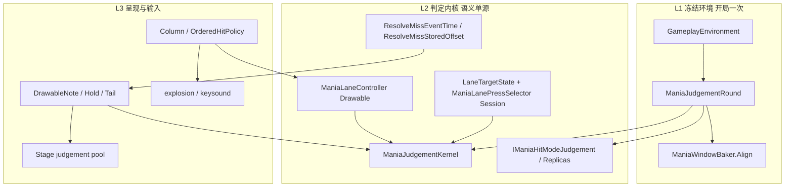
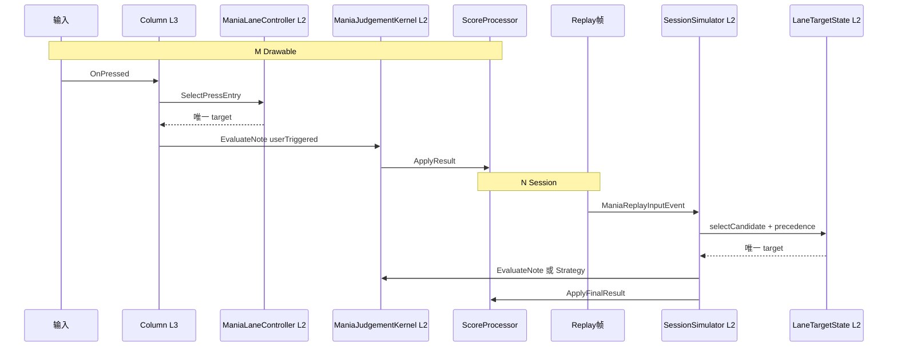

# Mania 局内判定运行时架构（RUNTIME）

> **用途**：描述 **局内谁算什么、状态放哪一层**；与数据面文档 [`MANIA-SCORE-DATA-SOURCE-REGISTRY.md`](./MANIA-SCORE-DATA-SOURCE-REGISTRY.md)（谁读 Realm / Now vs list）互补。  
> **创建日期**：2026-07-13  
> **状态**：Arch-A 初稿；用 `❓` 标待你实测或纠正的格。

---

## 0. 三份文档怎么分工

| 文档 | 回答的问题 |
|------|-----------|
| [`MANIA-SCORE-DATA-SOURCE-REGISTRY.md`](./MANIA-SCORE-DATA-SOURCE-REGISTRY.md) | **数据从哪来**、写不写 Realm、list / Now / Original 各读什么 |
| [`REPLAY_JUDGE_MERGE.md`](../../osu.Game.Rulesets.Mania/EzMania/ReplayJudge/REPLAY_JUDGE_MERGE.md) | **Session 黄金标准**：M ≡ N 字段级 parity、HitMode 双轨 |
| **本文件（RUNTIME）** | **运行时三层**、M/N 各持有什么状态、6–7 月增量是否合理、性能/偏后疑点从哪层长出来 |

**阅读顺序**：先 REGISTRY §2–§6 理解 M/N 产品语义 → 本文件 §1–§4 理解局内分层 → 需要改 Session 细节时再翻 REPLAY_JUDGE_MERGE。

---

## 1. 运行时三层（L1 / L2 / L3）



| 层 | 应持有 | 不应做 |
|----|--------|--------|
| **L1** | HitMode、HealthMode、JudgePrecedence、PoorEnabled、strategy 指针；物件上 bake 好的 `ManiaHitWindows` | 热路径 `GlobalConfigStore.Get` |
| **L2** | note-lock 选目标、press/auto-miss **语义**、miss stored offset **算法**、BMS route 状态 | UI、Realm、Graph、皮肤 |
| **L3** | 输入边沿、列级 press 路由调用、视觉/音效反馈 | 复制 Session 级无限 press 历史；自建第二套判定 |

---

## 2. M 与 N：两条运行时管线

### 2.1 定义（与 REGISTRY §6.2 一致）

| 代号 | 引擎 | 典型入口 |
|------|------|----------|
| **M** | Drawable `ScoreProcessor` + 列路由 | 本地打完、ReplayPlayer 回放后 list |
| **N** | `ManiaReplaySession.Run` | 手动重算、Graph Now、StatisticsPanel 补 HitEvents |

**设计不变式**：同 score + 同 environment → **M ≡ N**（HitEvents 字段级 + Statistics）。

### 2.2 并排时序（同一按键）



**应对齐的 L2 步骤**：列级选目标（Combo/Duration/Earliest/BMS post-Bad）、Kernel/Strategy 求结果、被动 miss 的 stored offset 语义。

**允许 M 独有**：`DrawableHitObject` 生命周期、explosion、keysound、O2 hold 的每帧 `Update` 视觉。

**允许 N 独有**：`PressTimesByColumn` 从 **replay 帧解析**（非游玩中 append）；`applyForcedMisses` end-sweep。

---

## 3. M/N 共享边界表（审查核心）

符号：`⛔` 设计正确 · `✎` 实现可瘦身 · `❌` 错层/应重构 · `❓` 待你确认

| 能力 | M（Drawable） | N（Session） | 评级 | 说明 |
|------|---------------|--------------|------|------|
| 环境冻结 | `ManiaJudgementRound.Create` @ `LoadComplete` | `run()` 内 `ManiaJudgementRound.Create` | ⛔ | L1 开局一次 |
| 物件窗口 | `ManiaWindowBaker.Align` | 同左 | ⛔ | WINDOW-BAKE |
| press 目标选择 | `ManiaLaneController.SelectPressEntry` | `ManiaLanePressSelector` + `selectCandidate` | ✎ | COLUMN-INPUT 后大体对齐；BMS/LN 边缘仍偶发 M≠N |
| Ez note 判定 | `ManiaEzDrawableJudgement` → **Kernel** | Simulator → **Kernel**（BMS press 除外） | ✎ | BMS Session press 仍直连 `EvaluateSessionPress`，未走 Kernel |
| Lazer 判定 | 官方 `CheckForResult` inline | `Lazer*Replica` | ⛔ | 双轨设计 |
| automiss 早退 | `ManiaAutoMissGate` | 同语义（进 Ez 链前） | ✎ | Gate 在 `CheckForResult` **内**；帧外仍每帧进 `UpdateResult` |
| miss stored offset **算法** | `ManiaDrawableMissTiming` → `ResolveMissStoredOffset` | `ResolveMissEventTime` / `ResolveMissStoredOffset` | ⛔ | **算法单点**在 `ManiaReplaySessionSimulator` |
| miss stored offset **数据** | `Column.pressTimes` 无限 append + 全量快照 | `PressTimesByColumn` 从 replay 解析，有界于 replay 长度 | ❌ | Drawable 数据层错层：无界 + O(n) 拷贝 |
| BMS route 状态 | `ManiaLaneEntry.BmsRoute` + CWT fallback | `LaneTargetState.BmsRoute` | ✎ | tail 仍 per-drawable CWT（backlog BMS-ROUTE-COL） |
| HitEvents / Statistics | `ScoreProcessor` 终局 | `Run` → `PopulateScore` | ⛔ | N 为离线权威；M 为游玩参考 |
| Graph Now | — | `ManiaReplaySessionService.RunRequestAsync` | ⛔ | 不读 Realm 统计 |
| Graph Rejudge 预览 | — | **非** Session；`GetDisplayResult` 单事件映射 | ⛔ | debounce 前 UI 预览，≠ 全谱重仿真 |
| Timeline / Race | — | `RunTimeline` / `RunTimelineDirect` | ⛔ | 与 Drawable 隔离；禁止终局 TotalScore 冒充 ghost |

---

## 4. 6–7 月增量清单（独立 sweep）

不只对照「列数多、连打粘」症状；下列为代码库主动扫出的模块。

| 代号 / 时期 | 模块 | 文件锚点 | 意图 | 评级 | 备注 |
|-------------|------|----------|------|------|------|
| ROUND-FREEZE | 单局冻结 | `ManiaJudgementRound.cs` | 热路径不读 config | ⛔ | 仍有 fallback 破例（见 §6） |
| WINDOW-BAKE | 谱面窗口 | `ManiaWindowBaker.cs` | 物件 `ManiaHitWindows` 开局对齐 | ⛔ | |
| COLUMN-INPUT | 列级 press | `Column.cs`, `OrderedHitPolicy.cs`, `ManiaInputManager.cs` | 每键 O(1) 路由，避免 N 路冒泡 | ⛔ | C2；回放与本地同路径 |
| LANE-PRECEDENCE | note-lock | `ManiaLaneController.cs`, `ManiaLanePressSelector.cs` | Combo/Duration/Earliest 对齐 | ✎ | `CollectOverlappingEntries` 每次全列扫 max 窗 |
| KERNEL-ONE | 共用内核 | `ManiaJudgementKernel.cs` | Drawable+Session 同 note/tail 语义 | ✎ | BMS Session press 旁路 Kernel |
| AUTO-MISS-GATE | automiss 早退 | `ManiaAutoMissGate.cs` | 未进 miss 窗跳过 Ez 链 | ✎ | 未在 `UpdateAfterChildren` 前跳过整帧 |
| MISS-STORED-OFFSET | 被动 miss 时间 | `ManiaDrawableMissTiming.cs`, `Column.pressTimes` | M≡N 的 TimeOffset | ❌ | **算法对、Drawable 数据实现错** |
| FORCE-MISS-WINDOW | Session 扫尾 | `ManiaReplaySession.applyForcedMisses` | 未判物件强制 miss | ⛔ | |
| Graph Now | 统计图 | `EzScoreGraphMania.cs` | Session ForLive + offset | ⛔ | Rejudge 与 Now 分层见 §5 |
| Timeline | 分数时间线 | `ManiaReplayTimelineRecorder.cs` | 一遍 SP 多出口 | ⛔ | 见 `EZ-SR-TL-REGISTRY.md` |
| Race | Ghost HUD | `EzScoreRaceService`, `EzScoreTimelineBuilder` | `RunTimelineDirect`, ignoreOffset | ⛔ | 与局内 Drawable 无耦合 |
| HitEventGenerator | 薄壳 | `ManiaScoreHitEventGenerator.cs` | 委托 Session，非第二套逻辑 | ⛔ | ✎ 同步 `GetResult()` 阻塞 |
| M/N parity 测试 | 自动化 | `TestSceneReplaySessionParity`, `ManiaJudgePrecedenceParityTest` | 守住 M≡N | ⛔ | 真谱 EZ2AC/O2 仍手工偏 |

---

## 5. 四条消费链（避免混淆）

### 5.1 局内游玩（M 热路径）

```
输入 → Column.OnPressed → LaneController → Kernel/inline → ScoreProcessor
每帧：Drawable.UpdateAfterChildren → UpdateResult(false) → automiss
```

**性能疑点主战场**：§6 反模式 2、3、4。

### 5.2 离线 Session（N）

```
Replay → ManiaReplaySession.run → Simulator → Kernel/Replica → PopulateScore
可选：ManiaReplayTimelineRecorder（同遍仿真）
```

**不应**为 parity 在 Drawable 再跑一遍 Session；**应**让 L2 语义一致。

### 5.3 Graph 三轨

| 轨 | 引擎 | 评级 |
|----|------|------|
| Original | Realm / 进面板时 ScoreInfo 快照 | ⛔ |
| Now | 完整 `ManiaReplaySession`（ForLive, offset 可含） | ⛔ |
| Rejudge 预览 | Session HitEvents + `RejudgeHitEvent` 窗口映射 | ⛔ 展示层，≠ Session 重跑 |

❓ 拖 offset 时预览与落定 Session 的体感差异是否为「粘滞」来源之一（待你主观确认）。

### 5.4 Race / Timeline

`EzScoreTimelineBuilder` → `RunTimelineDirect(ForLive, ignoreOffset)`；**不**经过 Drawable，**不**写 Realm。

---

## 6. 反模式目录（防止再踩）

| ID | 反模式 | 现状 | 应改为 | 关联 UX |
|----|--------|------|--------|---------|
| AP-1 | Drawable **无限**维护 press 历史 | `Column.pressTimes` 只 append | 有界缓冲或 replay 注入；与 Session 同算法不同数据源 | 越久越卡；offset 误配旧 press |
| AP-2 | 为 parity **快照**全列表 | `GetPressTimesSnapshot` + `new Dictionary` 每次 miss | 列内 `ResolveNearestPress` 零分配 | automiss 密集时 GC 尖峰 |
| AP-3 | 每帧全量 `UpdateResult` | `DrawableHitObject.UpdateAfterChildren` | Mania 子类在 miss **窗外**跳过整帧 | 列多、note 多在屏上 |
| AP-4 | overlap 每次 **O(列长)** 扫 max 窗 | `CollectOverlappingEntries` 首部 foreach | Register/Unregister 增量维护 max | Combo/Duration 连打 |
| AP-5 | 热路径读 config | `AllowPoorEnabled`, `OrderedHitPolicyHelper` 无参重载 | 读 `JudgementRound` 冻结值 | 次要，但违反 L1 |
| AP-6 | 反馈与判定绑死 | 每按 `sampleTriggerSource.Play()` | 仅 routed hit 或节流（SOUND-DECOUPLE） | 6kps 像 3kps 反馈 |
| AP-7 | 把 Rejudge 当 Session | Graph debounce 预览 | 文档/命名区分；权威仍 Now=Session | 分析时误判数据源 |

---

## 7. 疑点 → 验证 → 修复映射

| ID | 疑点 | 架构评级 | 验证（非只加日志） | 修复方向 |
|----|------|----------|-------------------|----------|
| **P0-1** | `pressTimes` 无界 + miss 全量拷贝 | ❌ | micro-bench：`pressTimes.Count` vs 游玩时长；单次 `ResolveStoredOffset` 耗时 | Fix-1：有界缓冲 + 列内零分配最近邻 |
| **P0-2** | 每帧 `UpdateResult` × alive note 数 | ✎ | 计数 `CheckForResult`/秒（`ManiaJudgeHotPathTrace`）× 8K | Fix-2：miss 窗外跳过 `UpdateAfterChildren` |
| **P1-1** | `CollectOverlappingEntries` 全列扫 | ✎ | press 路径 bench Combo 80ms jack | Fix-3：增量 max 窗 + scratch List |
| **P1-2** | `hitExplosionPool` 容量 5/列 | ✎ | 高 KPS 目视 + pool 饥饿 | Fix-4：按 key 缩放 / 解耦 keysound |
| **P2-1** | stored offset 误配导致统计偏后 | ❓ | Fix-1 前后同谱 offset 分布对比 | 与 P0-1 同修；仍偏则 §8 审计 |
| **P2-2** | note-lock 拒绝 early hit | ❓ | 与 Session 对比 HitEvent `TimeOffset` 符号分布 | 玩法 parity，非纯性能 |
| **P2-3** | `EzSubFrameCorrection` 默认关 | ❓ | 开关 A/B 同谱 | 输入时钟，独立实验 |

**审查阶段（Arch-A）交付物**：本表 + §3 边界表。  
**下一阶段**：对 **P0-1、P0-2** 做 micro-bench 取 before 数字 → 再动 Fix-1/2。

---

## 8. offset 偏后（独立线，不与 FPS 混修）

可能与性能同源（AP-1 误配 press），也可能无关：

| 假设 | 机制 | 验证 |
|------|------|------|
| H-offset-1 | miss 的 stored offset 取「距 note 终点最近 press」，历史越长越易配错 | Fix-1 后复测 |
| H-offset-2 | note-lock / Earliest 打掉偏早击打 | M vs N HitEvent 对比；真谱 |
| H-offset-3 | 用户触发路径未开子帧修正 | `EzSubFrameCorrectionEnabled` A/B |
| H-offset-4 | 输入路由比 drawable 直触多一层延迟 | `Column.OnPressed` vs `OnNewResult` 时间戳日志 |

⛔ 不在未证实前改 HitMode 玩法语义。

---

## 9. 关键文件索引

| 路径 | 层 |
|------|-----|
| `osu.Game.Rulesets.Mania/UI/DrawableManiaRuleset.cs` | L1 冻结 |
| `osu.Game.Rulesets.Mania/UI/Column.cs` | L3 输入 + ❌ pressTimes |
| `osu.Game.Rulesets.Mania/UI/OrderedHitPolicy.cs` | L3→L2 路由 |
| `osu.Game.Rulesets.Mania/EzMania/ReplayJudge/ManiaLaneController.cs` | L2 Drawable 列状态 |
| `osu.Game.Rulesets.Mania/EzMania/ReplayJudge/ManiaReplaySessionSimulator.cs` | L2 Session + miss 算法 |
| `osu.Game.Rulesets.Mania/EzMania/ReplayJudge/ManiaJudgementKernel.cs` | L2 共用内核 |
| `osu.Game.Rulesets.Mania/EzMania/ReplayJudge/ManiaEzDrawableJudgement.cs` | L3→L2 Drawable 入口 |
| `osu.Game.Rulesets.Mania/EzMania/ReplayJudge/ManiaDrawableMissTiming.cs` | L3→L2 miss 委托 |
| `osu.Game.Rulesets.Mania/EzMania/ReplayJudge/ManiaAutoMissGate.cs` | L2 automiss 门 |
| `osu.Game.Rulesets.Mania/EzMania/Statistics/EzScoreGraphMania.cs` | 消费 N（Graph） |
| `osu.Game/EzOsuGame/Scoring/EzScoreRaceService.cs` | 消费 N（Race） |

性能 backlog 明细：[`HIGH_KPS_JUDGE_BACKLOG.md`](../../osu.Game.Rulesets.Mania/EzMania/ReplayJudge/HIGH_KPS_JUDGE_BACKLOG.md)

---

## 10. 维护约定

| 约定 |
|------|
| ⛔ 改 L2 语义或 M/N 边界前，先改 **§3 对应格**，再改代码。 |
| ⛔ 新功能不得引入 AP-1～AP-7 类反模式；若不得已，在本表 §6 登记。 |
| ✎ 性能修复只动 **§7 已标评级** 的项；Fix 后更新 bench 数字写进变更记录。 |
| 数据面争议查 REGISTRY；Session 字段 parity 查 REPLAY_JUDGE_MERGE。 |

---

## 11. 变更记录

| 日期 | 说明 |
|------|------|
| 2026-07-13 | Arch-A 初稿：三层图、M/N 边界表、6–7 月 sweep、反模式、疑点映射 |
