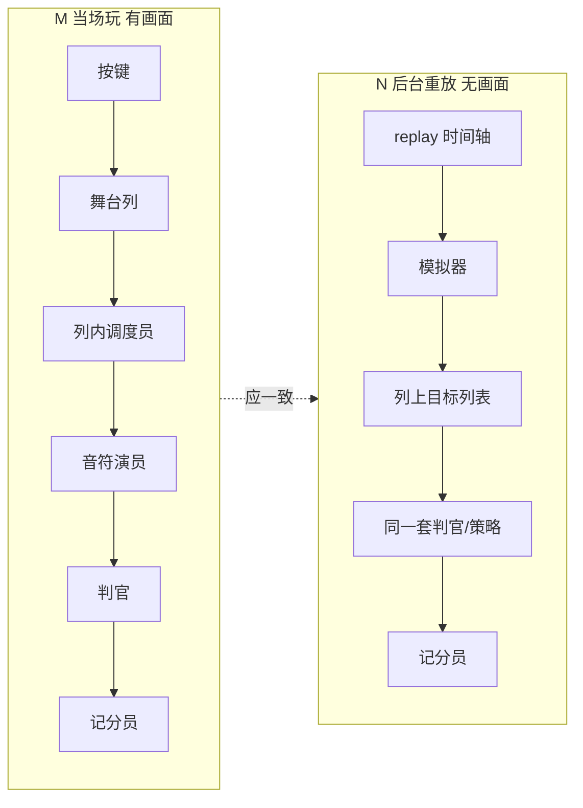

# Mania 局内判定 — 运行时大局观

> **写给谁**：需要「谁是谁、为什么有两套、6–7 月改了什么」的人；**不**要求先认类名。  
> **和别的文档关系**：[`MANIA-SCORE-DATA-SOURCE-REGISTRY.md`](./MANIA-SCORE-DATA-SOURCE-REGISTRY.md) 管 **成绩数字从哪读**；本文件管 **局里怎么判**。  
> **状态**：2026-07-13 第二版（叙事优先）；细节代码见文末附录。

---

## 0. 先用一句话说清楚

Ez Mania 在官方 osu! lazer 的「画面上有音符、按了算分」之上，加了两件大事：

1. **多种 HitMode**（IIDX / O2 / EZ2AC / BMS…）——同一种 Perfect，窗口和名字都不一样。  
2. **两套算分路径必须一致**——你**亲手打**出来的结果（**M**），和用**同一份 replay 在后台重放**算出来的结果（**N**），在相同环境下必须一样。

6–7 月的大量改动，本质都是在追第 2 条（M ≡ N），同时把按键从「每个音符自己抢输入」收成「每列只判一个目标」。  
**性能卡顿、offset 偏后**，是这套改动在 **局内 Drawable 路径**上叠出来的副作用，不是单独某个 HUD 的小 bug。

---

## 1. 角色表：谁是谁（先记人名，再记类名）

把系统想成一场演出里的岗位，而不是一堆 C# 文件。

| 你心里的名字 | 实际上是 | 干什么 | 什么时候出现 |
|-------------|---------|--------|-------------|
| **你 / 键盘** | 输入 | 按下某一列 | 全程 |
| **舞台列** | `Column` | 8K 就有 8 个「竖条接待员」；先接到键，再决定这键判给谁 | 只在**局内** |
| **列内调度员** | `ManiaLaneController` | 一列里很多 note 叠在一起时，按 Combo/Duration/Earliest 规则**只选一个**该吃的 note | 只在**局内** |
| **音符演员** | `DrawableNote` / Hold | 在屏幕上滚动；被选中才「吃键」并出分 | 只在**局内** |
| **本局规则手册** | `ManiaJudgementRound` | 开局冻结：这局是 IIDX 还是 Lazer、KPoor 开不开、优先级是什么 | 局内开局读一次 |
| **判官** | `ManiaJudgementKernel` + 各 HitMode 策略 | 给定「谁被选中 + 按早了还是晚了」，产出 Perfect/Miss… | 局内 + 后台**共用** |
| **记分员** | `ScoreProcessor` | 把判官结果变成分数、连击、Statistics | 两边最后都找它 |
| **M：当场裁判** | Drawable 整条链 | 你打 / 看回放时，**真的在画面上玩**走的路径 | 打完、ReplayPlayer |
| **N：录像室裁判** | `ManiaReplaySession` | **不画画面**，只读 replay 时间轴，在内存里模拟同样规则 | 重算、统计图 Now、补 HitEvents |
| **统计图** | `EzScoreGraphMania` | 左栏 Original = 进面板时快照；Now = 叫 **N** 用当前设置再算一遍 | 选歌拓展分析 |
| **角逐幽灵** | `EzScoreRaceService` + Timeline | 只要「分数随时间曲线」，不要完整 HitEvents 故事 | 打歌 HUD |
| **薄转发** | `ManiaScoreHitEventGenerator` | 几乎不判 note，只是帮面板去叫 **N** | 缺 HitEvents 时 |

**关键关系**：

- **M 和 N 不是两个产品功能**，是同一套规则的两种跑法。设计目标是 **结果一致**。  
- **列 / 调度员 / 音符** 只存在于 **M（有画面）**。  
- **N** 用另一套数据结构（列上的「目标列表」）做**同一件事**，不经过 Column 画出来。

---

## 2. 两条世界线（M 和 N）

| | M（Drawable） | N（Session） |
|---|---------------|--------------|
| **典型场景** | 本地打完；点「观看回放」 | 选歌「重算」；统计图 **Now**；面板补 HitEvents |
| **有没有画面** | 有 | 无 |
| **输入从哪来** | 键盘 / 回放驱动 Column | replay 里记录的 press 时间 |
| **谁负责「叠键选哪一个」** | 列内调度员 | 模拟器里的列目标列表 |
| **产品上的地位** | 玩家体感的「真相」 | 离线分析、入库重算的「标准答案」 |
| **当前关系** | 设计：**应相等**；实践：部分 HitMode / 真谱仍有缝（见 REGISTRY §6.3） |

你不需要先记住 `ManiaReplaySessionSimulator` 这个名字——记住 **N = 不看屏幕的录像室重判** 即可。

---

## 3. 两个故事：按一次键 / 过一帧

### 3.1 你按一次键（局内 M）

以前（COLUMN-INPUT 之前）：一按可能触发一列上**很多音符**各自处理，成本高、规则和 N 也容易分叉。

现在（6–7 月之后） intended 流程：

1. **舞台列**接到键（每列一个接待员，8K 就 8 路并行）。  
2. **列内调度员**看：这一列此刻叠着哪些 note？按你设的 Combo/Duration/Earliest，**只挑一个**作为本键目标。  
3. 挑中的 **音符演员** 去请 **判官**：早了还是晚了 → Perfect / Good / Miss…  
4. **记分员**记一笔；光效、音效在列上播（和判几分是两条线，但绑在同一次按键附近）。

BMS 还多一步：先 Bad 再 KPoor 之类的「二次路由」，调度员和判官都要认同一套状态——这是 M/N 对齐最难的一块之一。

### 3.2 过了一帧（你没按键）

画面上还有很多 **还没判** 的 note。引擎**每帧**问一遍：「是不是已经错过到该算 Miss 了？」——这叫 **automiss**。

- 这和「你按了键」是**另一条路**，但共用同一判官规则。  
- 6–7 月加了 **早退**：离判定线还远就先不算，省 CPU。  
- 但 note 只要在屏幕上活着，仍可能**每帧被问一次**——列越多、同时可见 note 越多，问得越频繁。这是你体感「4K 就开始沉」的重要来源之一。

### 3.3 被动 Miss 为什么要记「你什么时候按过键」

有一类 Miss 不是你松手打空的，而是 **note 滑过线自动 Miss**。为了和 **N** 统计一致，这类 Miss 的「事件时间」不总是「当前帧」，而是：**这一列你最近一次按键，离这个 note 有多近**。

- **N** 的做法：replay 里本来就有每次 press 的时间，模拟时查表即可。  
- **M** 的做法（6–7 月）：Column 自己 **一直记着** 你按过的时间列表，Miss 时去查最近的一次。

**想法是对的**（和 N 对齐）。**实现上**在 M 侧做成了「整局无限变长的列表 + 每次 Miss 复制整份列表去查」——这是当前最可疑的性能/偏后根源（见 §5）。

---

## 4. 6–7 月到底加了什么？初衷 vs 现状

不用记代号，按「想解决什么问题」记：

| 想解决的问题 | 加了什么（白话） | 初衷 | 现状判断 |
|-------------|-----------------|------|----------|
| M 和 N 判定规则两套、越修越分叉 | 共用 **判官** + HitMode 策略文件 | **对的方向** | 大体成立；BMS press、个别 HitMode 仍有旁路 |
| 一按触发一列无数个 note | **列先接键**，每键只选一个目标 | **对的方向** | 局内已为主路径；回放与本地同路 |
| 开局 HitMode 还在变 | **本局规则手册**开局冻结 | **对的方向** | 少数预览场景仍会临时读配置 |
| 叠键 Combo/Duration 和 N 不一致 | 列内调度员与 N 模拟器**对齐算法** | **对的方向** | 小谱测试绿；真谱、个别 Mode 仍偏 |
| automiss 每帧太重 | **早退**：还进不了 Miss 窗就不跑判官 | **对的方向** | 早退太晚，帧入口仍进得去 |
| 被动 Miss 的 TimeOffset 和 N 不一致 | M 也记 press 时间，用**同一套**「最近邻」公式 | **想法对** | **M 侧记法过重**（无限列表+快照），可疑 |
| 成绩分析要 Now / Timeline / Race | 一律叫 **N** 算，不另写第三套判定 | **对的方向** | Graph/Race 与局内 Drawable 已隔离 |
| 统计图拖 offset 要即时反馈 | **Rejudge 预览**（只改展示，不全局重仿真） | **产品上对** | 容易和 Now=Session 混淆，见 §6 |

**一句话**：6–7 月大方向（M≡N、列级路由、共用判官、开局冻结）**整体是对的**；痛点集中在 **「为对齐 N 而在 Drawable 上复制的数据」做得太重**，以及 **automiss 仍按「屏幕上活着的 note 数」线性放大**。

---

## 5. 当前判断：什么算对、什么算偏、什么算错

不用符号堆砌；这是**审查结论**，你可整段推翻或标「待定」。

### 认为 **方向对**（值得保留，最多优化实现）

- M 与 N 双路径，且以 **M 游玩体验为参照、N 必须追上**。  
- 按键先进 **列**，再选唯一 note，而不是每个 note 抢输入。  
- 开局冻结 HitMode / HealthMode / 优先级，局内少读配置。  
- Ez HitMode 的判定语义进 **判官 + 策略**，Drawable 和 Session 共用。  
- 统计图 **Now、重算、补 HitEvents** 都走 **N**，不另造第三套判定。  
- Timeline / 角逐只要曲线，也走 **N** 的专用出口，不绑局内 Drawable。

### 认为 **实现偏重**（方向对，但可能是你卡顿/粘滞的主因）

- **列上无限增长的按键时间列表** + Miss 时整表复制查找。  
- **每个可见 note 每帧** 仍进入 automiss 询问（早退在链条偏后）。  
- Combo/Duration 选叠键目标时，仍可能 **扫整列** 算窗口。  
- 每按一次就播 keysound，和是否打中 note 不完全绑定。  
- 每列爆炸特效池很小，极高 KPS 时视觉像「跟不上手速」。

### 认为 **仍待对齐**（更偏正确性，不只是 FPS）

- 部分 HitMode 真谱上 **M 比 N 好**（Perfect 多、Miss 少）——REGISTRY §6.3。  
- BMS + Lazer 血量等边界场景曾大量 Miss(Poor)——小谱已修，真谱待你复测。  
- 结算 **offset 整体偏后**：可能与上面「按键时间列表配错旧按键」有关，也可能与 note-lock、子帧修正有关，**需分轨验证**。

### 容易 **想错** 的概念（读文档时别混）

| 容易以为 | 实际是 |
|---------|--------|
| 统计图拖 offset 时在重跑整局判定 | 多数是 **预览映射**；落定 debounce 后才叫 N |
| `HitEventGenerator` 是第二套判定 | **薄转发**，内部就是 N |
| M 和 N 各有一套「判官公式」 | Ez 路径应 **共用**；Lazer 是官方 inline vs Replica 双轨 |
| 为性能应让 Drawable 直接调 Session | **不对**；应让 **规则一致**，不是局内再跑一遍录像室 |
| 6–7 月改坏了，应整体回滚 | **不对**；应减掉 **错重的实现**（如无限 press 列表），保留列路由与 M≡N 目标 |

---

## 6. 和你的体感的对应

| 你的体感 | 更可能对应什么（按优先级猜） |
|---------|---------------------------|
| 列数越多越沉 | 列数 × 每列可见 note 数 × 每帧 automiss 询问；8 条列各维护自己的状态 |
| 打得越久越沉 | 列上 **按键时间列表从不裁剪**，Miss 时查找越来越贵 |
| 6kps 手感像 3kps 光效 | 特效池 / keysound 与判定解耦不足（**反馈层**，不一定判晚了） |
| 很少负 offset、整体偏后 | 被动 Miss 的「最近按键」配到 **更早的另一次按键**；或 note-lock；或子帧修正默认关——**和 FPS 分开查** |
| LN 多的谱更卡 | 更多 **活着的 drawable** 参与每帧 automiss；hold 还有额外每帧逻辑 |

---

## 7. 接下来建议怎么走（仍不写具体改哪行）

1. **你读一遍 §1–§5**，在 §5 表格旁直接批「不同意 / 待定」——比改代码重要。  
2. **验证只盯 §5「实现偏重」前两条**：按键列表长度 vs 游玩时长；每帧 automiss 调用次数 vs 列数——用 bench 或诊断计数，不是堆日志。  
3. **改代码顺序**：先瘦 **按键时间列表**（和 N 公式一致、但 M 侧别无限记），再瘦 **automiss 帧入口**，再动叠键扫描和光效。  
4. **offset 偏后** 在 2 做完后复测；仍偏再开「玩法 / 时钟」线，不和 FPS 混在一个 PR。

详细文件索引、旧版符号表见 **附录**；日常讨论以 **§1–§6** 为准。

---

## 附录 A. 符号与层级（给要改代码的人）

| 符号 | 含义 |
|------|------|
| L1 | 开局冻结环境 |
| L2 | 判定语义（调度、判官、miss 公式） |
| L3 | 输入、绘制、音效 |

M/N 边界、P0 疑点、反模式 ID 的细表见 git 历史 `40e9e6d60d` 初稿；需要时再拉回正文。

---

## 附录 B. 类名 ↔ 角色速查

| 角色（§1） | 类 / 模块 |
|-----------|----------|
| 舞台列 | `Column`, `OrderedHitPolicy` |
| 列内调度员 | `ManiaLaneController`（M）/ `LaneTargetState` + `ManiaLanePressSelector`（N） |
| 本局规则手册 | `ManiaJudgementRound` |
| 判官 | `ManiaJudgementKernel`, `*HitModeJudgement`, `Lazer*Replica` |
| N 录像室 | `ManiaReplaySession`, `ManiaReplaySessionSimulator`, `ManiaReplaySessionService` |
| 被动 Miss 时间 | `ManiaDrawableMissTiming`（M）→ `ResolveMissStoredOffset`（公式在 Simulator） |
| automiss 早退 | `ManiaAutoMissGate` |

---

## 附录 C. 相关文档

- **总拓扑与批次**：[`MANIA-JUDGEMENT-TOPOLOGY.md`](./MANIA-JUDGEMENT-TOPOLOGY.md)  
- 数据面：[`MANIA-SCORE-DATA-SOURCE-REGISTRY.md`](./MANIA-SCORE-DATA-SOURCE-REGISTRY.md)  
- Session 字段 parity：[`REPLAY_JUDGE_MERGE.md`](../../osu.Game.Rulesets.Mania/EzMania/ReplayJudge/REPLAY_JUDGE_MERGE.md)  
- Timeline/Race：[`EZ-SR-TL-REGISTRY.md`](./EZ-SR-TL-REGISTRY.md)  
- 性能 backlog：[`HIGH_KPS_JUDGE_BACKLOG.md`](../../osu.Game.Rulesets.Mania/EzMania/ReplayJudge/HIGH_KPS_JUDGE_BACKLOG.md)

---

## 变更记录

| 日期 | 说明 |
|------|------|
| 2026-07-13 | 初稿（代码锚点、符号表为主） |
| 2026-07-13 | **第二版**：叙事优先；角色表、M/N 故事线、6–7 月初衷 vs 现状；细则下沉附录 |
