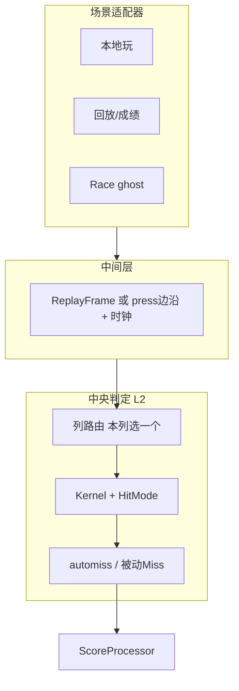
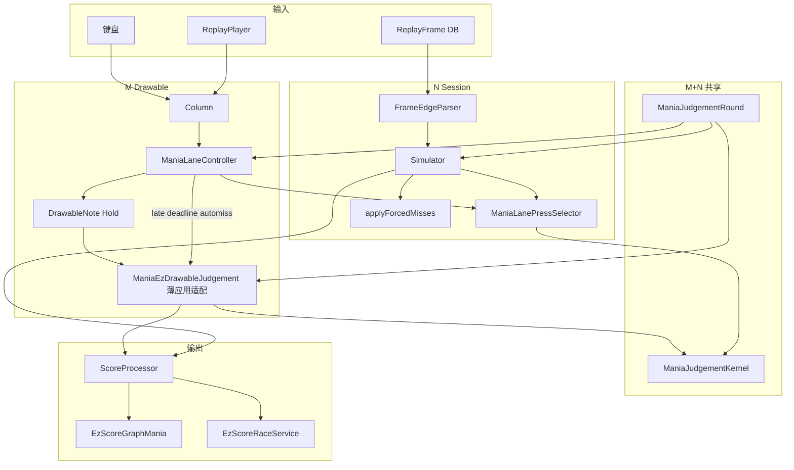

# Mania 判定 — 总拓扑（活文档）

> **用途**：全场景部件上台面、M/N 分叉、与「中央判定机」设想的差距；**实施优先级与批次**以此为准。  
> **姊妹文档**：[`MANIA-JUDGEMENT-RUNTIME.md`](./MANIA-JUDGEMENT-RUNTIME.md)（叙事/角色）、[`MANIA-SCORE-DATA-SOURCE-REGISTRY.md`](./MANIA-SCORE-DATA-SOURCE-REGISTRY.md)（数据面）。  
> **Cursor 详稿**：`osu-framework/.cursor/plans/mania_判定总拓扑_04712845.plan.md`（讨论过程可更长，本文件收收敛结论）。  
> **状态**：2026-07-13 初版；2026-07-14 以 `702be7` / `2026.614.0` 锁定月度架构基线。`ae471f` 仅是当日批次点，不再作为架构基线。

---

## 0. 实施优先级（分批次）

| 批次 | 内容 | 状态 |
|------|------|------|
| **1** | 本文件落地 + 链到 RUNTIME / REGISTRY | 完成 `f161089` |
| **2** | Drawable 验证：`ManiaJudgeHotPathTrace`（`pressTimes` max、MissOffset、PressSnapAlloc） | 完成 |
| **3** | **Fix-1**：`Column.pressTimes` 有界裁剪；`ManiaDrawableMissTiming` 零分配 | 完成 |
| **4** | **Fix-2**：automiss 更早 gate，减少未进 miss 窗的 `UpdateResult` 入口 | 完成 |
| **5** | **MLPS 扩充**（Earliest/Combo/Duration/BMS post-Bad）+ MLC 同位置直调；**overlap 边界缓存**（register 时算 max 窗，按不再整列扫） | 完成 |
| **6** | `ManiaScoreHitEventGenerator` 收口到 `RunHitEventsAsync`；补 HitEvents 路径 p50/p95 bench（目标参考 &lt;10ms） | 完成 |
| **7+** | ReplayFrame 边沿解析抽出 + Race `FeedMode`（BatchAllEvents / StreamByClock）开关 | 完成 |
| **8** | O2 Pill 状态单源：Round 内可变状态；Session/Race 不再写 Live HUD 静态量 | 完成 |
| **9** | Live automiss 迁到 Column late-deadline 队列；删除每 Drawable 每帧虚分派 | 完成 |
| **10** | 删除旧 `ManiaAutoMissGate`；micro-bench 改测真实 Column 队列 | 完成 |
| **11** | 删除 Mania `OrderedHitPolicy` 包装层；Column 直连唯一 `ManiaLaneController` | 完成 |

**原则**：先证 P0 疑点（批次 2）再改（3–4）；架构收拢（5–7）与 parity 测试同批。局内 FPS（Work/SwapBuffer）另案，见后续「热路径下一刀」。

---

## 1. 中央机设想（对照基准）

判定语义 **一份**；场景只差「谁、何时、以何格式送按键时间」。

---

## 2. 现状分层

| 层 | 现状 |
|----|------|
| **L1** | `ManiaJudgementRound` + `ManiaWindowBaker` — M/N 各建一份，语义同源 |
| **L2** | `ManiaJudgementKernel` + Strategy — **Ez M/N 共用**；Lazer = M inline / N Replica |
| **L2.5 列路由** | M=`ManiaLaneController` 唯一 Live 状态机；N=`LaneTargetState` 离线状态；二者在 `ManiaLanePressSelector` 共用纯选择语义，不混用状态 |
| **L3** | M：Column 输入 + late-deadline automiss；Drawable 只执行结果应用/视听；N：`parseReplay`→边沿 |
| **L4** | 光效/keysound — M 独有 |

**保留**：M≡N 目标；Graph/Race/重算走 N；Ez 判定公式单源。  
**收拢**：Column 直接持有 MLC；`OrderedHitPolicy` 已删。Session 状态不塞进 Live MLC，只共享无状态选择/判定公式。

---

## 3. 总拓扑图（全部件）

---

## 4. 部件登记（简表）

| 部件 | M/N | 接入 Kernel？ | 备注 |
|------|-----|--------------|------|
| `ManiaJudgementKernel` | M+N | **核心** | note/hold 评估 |
| `ManiaJudgementRound` | M+N | 配置 | 开局冻结 |
| `ManiaLaneController` | M | 否 | **唯一 Live 列状态机**：注册/游标/press/ActiveHold/automiss deadline |
| `ManiaLanePressSelector` | M+N | 否 | **press 选目标**（Earliest/Combo/Duration/BMS post-Bad Drawable + Session） |
| `collectCandidatesForInput` | N | 否 | Session 列候选；与 M `CollectOverlappingEntries` 语义对齐 |
| `Column.pressTimes` | M | 否 | **Fix-1** 有界列表 |
| `ManiaDrawableMissTiming` | M | 公式=N | **Fix-1** 零分配 |
| Column automiss deadline queue | M | 门前 | late miss 边界后才访问到期对象；`ManiaAutoMissGate` 已删除 |
| `parseReplay` / `ManiaReplayFrameEdgeParser` | N | 否 | Session 边沿解析；Batch / Stream 游标共用 |
| `ManiaFramedReplayInputHandler` | M | 否 | Drawable 回放帧态喂入；与边沿解析分工（不合并成一类） |
| `ManiaScoreHitEventGenerator` | — | — | **Obsolete**；请用 `RunHitEventsAsync` |
| `EzScoreRaceService` | N | 预建 / 流式 | `EzReplayFeedMode`：BatchAllEvents 阻塞进局；StreamByClock 不阻塞 |

**关注**：登记表中 M 专用 / N 专用 多，真正 M+N 少 — 调整拓扑时有意识收拢，不必一次做完。

---

## 5. 已确认的设计决策

### 5.1 MLPS 与 MLC

- **MLPS**（可改名 `ManiaLanePressPolicy`）：独立轻量 **press 选目标**；扩全 Earliest / Combo / Duration / BMS post-Bad 后 **够 N 用**。
- **MLC**：唯一 Live 列状态机，持有 Drawable 注册/游标/ActiveHold/automiss deadline；Column 直接调用，不再经过 `OrderedHitPolicy`。
- **Session**：保留无 Drawable 的 `LaneTargetState`；不混入 MLC。M/N 只共享 MLPS 与 Kernel 的纯语义。

### 5.2 列路由（Combo/Duration）

- 按 **本列** 一次 press，看 **overlap 候选**（`CollectOverlappingEntries` 用 register 时缓存的列 max miss 窗，不再每按扫全列）。
- BMS Drawable 侧 post-Bad KPoor 已进 MLPS；Session 侧仍用 `BmsHitModeJudgement.TryRoutePostBadKPoor`（待与 MLPS 合并）。

### 5.3 ReplayFrame

- Session：`ManiaReplayFrameEdgeParser`（`ParseAll` / `ManiaReplayFrameEdgeCursor.DrainUntil`）产出边沿；`ManiaReplaySession` 委托之。
- Drawable 回放仍走 `ManiaFramedReplayInputHandler`（帧态→按键系统）；与边沿解析 **分工保留**。
- 枚举 `EzReplayFeedMode` 在 `osu.Game/EzOsuGame/Scoring`；Race / Session 共用语义。

### 5.4 Race

- 预建 timeline + HUD 插值 **不算偏离设计**。
- **`Ez2Setting.EzScoreRaceFeedMode`**：`BatchAllEvents`（默认，PlayerLoader 等 timeline）/ `StreamByClock`（进局不阻塞，后台就绪后插值）。

### 5.5 Generator

- `ManiaScoreHitEventGenerator` 已 **Obsolete**；生产代码走 `ManiaReplaySessionService.RunHitEventsAsync`。
- Bench：`BenchmarkManiaReplaySession.BenchmarkRunHitEventsAsync`；暖机延迟烟测 `ManiaRunHitEventsLatencyTest`。
- **DRAWABLE-MICRO-BENCH**：`ManiaLaneHotPathWorkload` / `ManiaLaneHotPathMicroBenchTest` / `BenchmarkManiaLaneHotPath`（10 列 × PeakKps × alive/col 8/24/40；Select+真实 automiss deadline queue+pressTimes，**不含** SwapBuffer）。
  - 远期对象每帧仅承担每列一次 deadline poll，不再按 alive 数逐 Drawable 调 `UpdateResult`。
  - Combo/Duration 曾因 (1) 每按 `new List`/Sort/`Func`、(2) `IsHitResultAllowed`→`GetHitModeValidHitResults` **每次 `new[]`**（经 `ResultFor`/`SelectFold` 放大）抬高 alloc；已改为 scratch + **静态表**（`GetHitModeValidHitResults` 常量数组，`IsHitResultAllowed` 直接扫静态表；曾加的 `IsHitResultValidForMode` switch 副本属冗余步骤，已删）。实测 Combo dense ~45 B/press（此前 ~1.8 KB）。
  - 可测排除：`ManiaAutoMissDeadlineTest` + future-deadline dueVisits==0；BMS/Poor Select alloc；`HitModeValidResultsAllocTest`；`DetachedBeatmapStoreFrameBudget` Drain≤24/帧；BDSP `StartupBackfillDelay`=5s（测试覆写 0）。

---

## 6. 场景喂入对照

| 场景 | 喂入 | 路径 |
|------|------|------|
| 本地玩 | 实时按键 | M |
| 看回放 | ReplayPlayer 帧→Column | M |
| 入库 | M 的 SP | Realm Statistics |
| 重算 / Graph Now | ReplayFrame→边沿 | N |
| 补 HitEvents | 同 N 全 Session | N（Generator 壳） |
| Race | N 预建 timeline | 打歌时插值 |
| Graph offset 拖动 | Rejudge | 非 Session |

---

## 7. 体感 ↔ 疑点

| 体感 | 优先疑点 |
|------|---------|
| 越久越卡 | `pressTimes` 无限增长 + Miss 快照 |
| 列多越卡 | 已改为每列一次 deadline poll；不再是未 Judged drawable × 每帧 automiss |
| LN 多更卡 | automiss 固定税已移除；剩余关注 hold 自身视觉 Update / draw |
| offset 偏后（不稳/周期/非正态） | 与帧时/Present 抖同源嫌疑；选歌掉帧另线 |
| **关 Race 冷启仍 ~500（历史 ~1300）** | 月度判定拓扑膨胀回归；已收敛 O2 双状态、每 Drawable automiss、`OrderedHitPolicy` 包装层；待实机对照 `702be7` |
| 选歌 3–5s 掉帧 | `BackgroundDataStoreProcessor` 回填 + `RealmDetachedBeatmapStore` Replace（已限流/延迟；与局内 500 分轨） |

---

## 8. 相关文档

- 叙事：[`MANIA-JUDGEMENT-RUNTIME.md`](./MANIA-JUDGEMENT-RUNTIME.md)
- 数据：[`MANIA-SCORE-DATA-SOURCE-REGISTRY.md`](./MANIA-SCORE-DATA-SOURCE-REGISTRY.md)
- Parity：[`REPLAY_JUDGE_MERGE.md`](../../osu.Game.Rulesets.Mania/EzMania/ReplayJudge/REPLAY_JUDGE_MERGE.md)
- 性能 backlog：[`HIGH_KPS_JUDGE_BACKLOG.md`](../../osu.Game.Rulesets.Mania/EzMania/ReplayJudge/HIGH_KPS_JUDGE_BACKLOG.md)

---

## 变更记录

| 日期 | 说明 |
|------|------|
| 2026-07-13 | 批次 2–3：`ManiaJudgeHotPathTrace` 扩展；Fix-1 有界 pressTimes + 零分配 MissTiming |
| 2026-07-14 | 批次 4：`DrawableHitObject.ShouldDeferAutoMissUpdate` + `ManiaAutoMissGate` 跳过 automiss 热路径 |
| 2026-07-14 | 批次 5：MLPS M/N 共用；MLC/Session 直调；overlap max 窗边界缓存 |
| 2026-07-14 | 批次 6：Generator Obsolete；Graph/测试改 RunHitEventsAsync；HitEvents BDN + 暖机延迟烟测 |
| 2026-07-14 | 批次 7+：`ManiaReplayFrameEdgeParser`；`EzReplayFeedMode` + Race 开关（StreamByClock 不阻塞进局） |
| 2026-07-14 | 非 Race FPS：Empty 窗 automiss defer；DetachedStore 每帧限流；BDSP 开工延迟 5s；pressTimes 保留窗收紧 |
| 2026-07-14 | MICRO-BENCH：alive 扫描 + Select overlap scratch / Func 缓存；`GetHitModeValidHitResults` 静态表（斩 ResultFor 热路径 `new[]`） |
| 2026-07-14 | 可测排除加固：AutoMissGate / Empty defer；BMS/Poor alloc；DetachedStore Drain≤24；BDSP StartupDelay 可覆写 |
| 2026-07-14 | 局内 500 回归：烘焙 `MissEarlyWindow`；ShouldDefer 内联；去双重 Gate；`IsHitResultValidForMode` O(1) switch |
| 2026-07-14 | 架构基线改锁 `702be7` / `2026.614.0`；废弃 `ae471f` 当日点作为月度基线 |
| 2026-07-14 | 判定收敛：O2 Round 状态单源；Session/Race 不写 Live HUD；变量 BPM 改由 Round 持有 beatmap 解析 |
| 2026-07-14 | Live automiss 迁到 Column late-deadline 队列；删除 `ShouldDeferAutoMissUpdate` 虚分派与 `ManiaAutoMissGate` |
| 2026-07-14 | 删除 Mania `OrderedHitPolicy`；Column 直连 MLC；bench 改测真实队列；48 项全模式 parity / 121 项 ReplayJudge 通过 |
