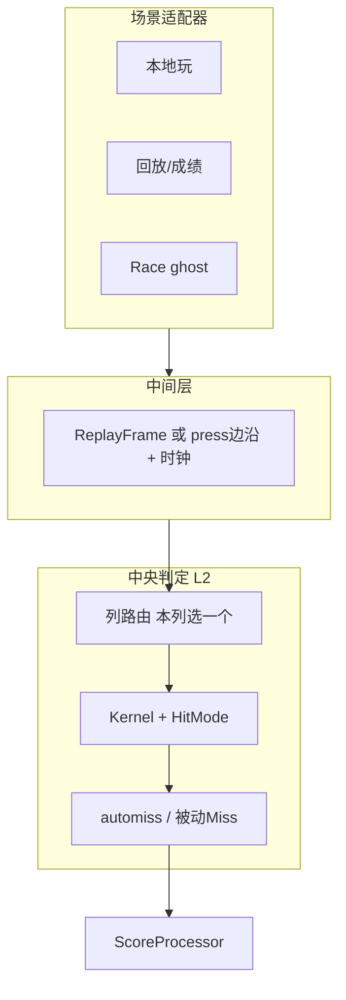
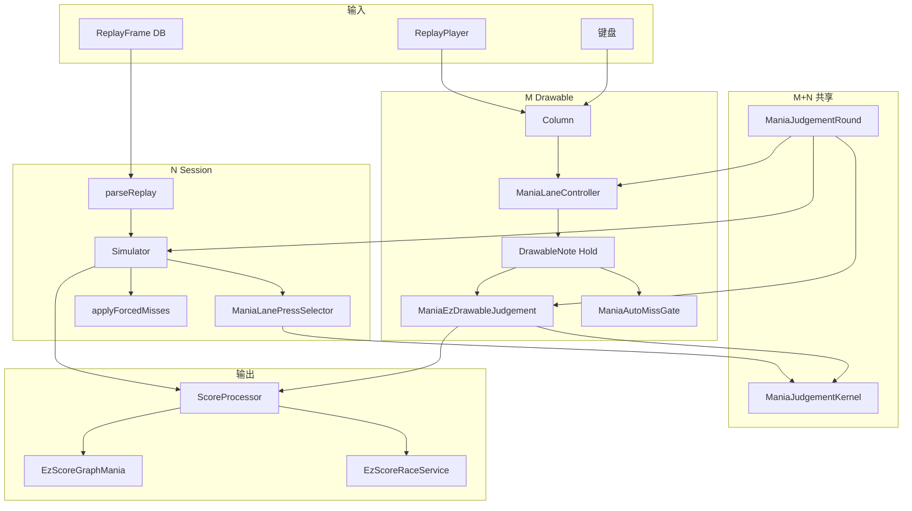

# Mania 判定 — 总拓扑（活文档）

> **用途**：全场景部件上台面、M/N 分叉、与「中央判定机」设想的差距；**实施优先级与批次**以此为准。  
> **姊妹文档**：[`MANIA-JUDGEMENT-RUNTIME.md`](./MANIA-JUDGEMENT-RUNTIME.md)（叙事/角色）、[`MANIA-SCORE-DATA-SOURCE-REGISTRY.md`](./MANIA-SCORE-DATA-SOURCE-REGISTRY.md)（数据面）。  
> **Cursor 详稿**：`osu-framework/.cursor/plans/mania_判定总拓扑_04712845.plan.md`（讨论过程可更长，本文件收收敛结论）。  
> **状态**：2026-07-13 初版；随批次推进 **随时增删改**。

---

## 0. 实施优先级（分批次）

| 批次 | 内容 | 状态 |
|------|------|------|
| **1** | 本文件落地 + 链到 RUNTIME / REGISTRY | 完成 `f161089` |
| **2** | Drawable 验证：`ManiaJudgeHotPathTrace`（`pressTimes` max、MissOffset、PressSnapAlloc） | 完成 |
| **3** | **Fix-1**：`Column.pressTimes` 有界裁剪；`ManiaDrawableMissTiming` 零分配 | 完成 |
| **4** | **Fix-2**：automiss 更早 gate，减少未进 miss 窗的 `UpdateResult` 入口 | 待做 |
| **5** | **MLPS 扩充**（Earliest/Combo/Duration/BMS post-Bad）+ MLC 同位置直调；**列候选局部化**（替代 `CollectOverlappingEntries` 整列 max 窗扫描） | 待做 |
| **6** | `ManiaScoreHitEventGenerator` 收口到 `RunHitEventsAsync`；补 HitEvents 路径 p50/p95 bench（目标参考 &lt;10ms） | 待做 |
| **7+** | ReplayFrame 统一消费上提 `EzReplaySession`；Race `FeedMode`（预建 vs 按 clock 喂入）bench + 开关 — **TODO，本阶段不实现** |  backlog |

**原则**：先证 P0 疑点（批次 2）再改（3–4）；架构收拢（5）与 parity 测试同批；长期项只记 TODO。

---

## 1. 中央机设想（对照基准）

判定语义 **一份**；场景只差「谁、何时、以何格式送按键时间」。

---

## 2. 现状分层

| 层 | 现状 |
|----|------|
| **L1** | `ManiaJudgementRound` + `ManiaWindowBaker` — M/N 各建一份，语义同源 |
| **L2** | `ManiaJudgementKernel` + Strategy — **Ez M/N 共用**；Lazer = M inline / N Replica |
| **L2.5 列路由** | **双份**：M=`ManiaLaneController`；N=`LaneTargetState` + 碎片逻辑 + `ManiaLanePressSelector`（仅 fold） |
| **L3** | M：Column/Drawable/每帧 automiss；N：`parseReplay`→边沿；ReplayPlayer 另路径 |
| **L4** | 光效/keysound — M 独有 |

**保留**：M≡N 目标；Graph/Race/重算走 N；Ez 判定公式单源。  
**收拢**：列 press 选择 → **扩充 MLPS**，MLC 只保留 Drawable 列状态；ReplayFrame 消费上提 Ez 层。

---

## 3. 总拓扑图（全部件）

---

## 4. 部件登记（简表）

| 部件 | M/N | 接入 Kernel？ | 备注 |
|------|-----|--------------|------|
| `ManiaJudgementKernel` | M+N | **核心** | note/hold 评估 |
| `ManiaJudgementRound` | M+N | 配置 | 开局冻结 |
| `ManiaLaneController` | M | 否 | Drawable 列状态 + 路由（应收瘦） |
| `ManiaLanePressSelector` | N（目标 M+N） | 否 | **待扩充**为完整 press 选目标；MLC 同位置直调 |
| `collectCandidatesForInput` | N | 否 | ≈ M 的 `CollectOverlappingEntries`（待局部化） |
| `Column.pressTimes` | M | 否 | **Fix-1** 有界列表 |
| `ManiaDrawableMissTiming` | M | 公式=N | **Fix-1** 零分配 |
| `ManiaAutoMissGate` | M | 门前 | **Fix-2** 更早 |
| `parseReplay` | N | 否 | 待上提 Ez 层 |
| `ManiaFramedReplayInputHandler` | M | 否 | 待与统一 ReplayFrame 消费合并 |
| `ManiaScoreHitEventGenerator` | N | 委托 | **重复 API**，= `RunHitEventsAsync` |
| `RejudgeHitEvent` | — | 否 | 展示旁路 |
| `EzScoreRaceService` | N | 预建 timeline | **TODO** FeedMode bench/开关 |

**关注**：登记表中 M 专用 / N 专用 多，真正 M+N 少 — 调整拓扑时有意识收拢，不必一次做完。

---

## 5. 已确认的设计决策

### 5.1 MLPS 与 MLC

- **MLPS**（可改名 `ManiaLanePressPolicy`）：独立轻量 **press 选目标**；扩全 Earliest / Combo / Duration / BMS post-Bad 后 **够 N 用**。
- **MLC**：保留 Drawable 注册/游标/ActiveHold；收集候选后 **与 N 相同位置调 MLPS**。

### 5.2 列路由（Combo/Duration）

- 按 **本列** 一次 press，看 **前后少量 note**，不按整列扫 max 窗（`CollectOverlappingEntries` 标为过度设计候选）。
- BMS 晚 KPoor 并进单列局部流程（待办 `route-bms-kpoor-local`）。

### 5.3 ReplayFrame

- 各场景应能 **直接消费 `ReplayFrame`**；中间层上提 `osu.Game/EzReplaySession`，减少 Mania 内 `parseReplay` 与 `ManiaFramedReplayInputHandler` 分叉。

### 5.4 Race

- 预建 timeline + HUD 插值 **不算偏离设计**。
- **TODO**：`FeedMode` = `BatchAllEvents` / `StreamByClock` + bench（本阶段不实现）。

### 5.5 Generator

- `ManiaScoreHitEventGenerator` = `RunHitEventsAsync` 的 **重复 API**；新代码只调 Service，Generator 待 obsolete。

---

## 6. 场景喂入对照

| 场景 | 喂入 | 路径 |
|------|------|------|
| 本地玩 | 实时按键 | M |
| 看回放 | ReplayPlayer 帧→Column | M |
| 入库 | M 的 SP | Realm Statistics |
| 重算 / Graph Now | ReplayFrame→边沿 | N |
| 补 HitEvents | 同 N 全 Session | N（Generator 壳） |
| Race | N 预建 timeline | 打歌时插值 |
| Graph offset 拖动 | Rejudge | 非 Session |

---

## 7. 体感 ↔ 疑点

| 体感 | 优先疑点 |
|------|---------|
| 越久越卡 | `pressTimes` 无限增长 + Miss 快照 |
| 列多越卡 | 每列未 Judged drawable × 每帧 automiss 入口 |
| LN 多更卡 | 存活 drawable 多 + hold Update |
| offset 偏后 | 被动 Miss 配错 press；Fix-1 后复测 |

---

## 8. 相关文档

- 叙事：[`MANIA-JUDGEMENT-RUNTIME.md`](./MANIA-JUDGEMENT-RUNTIME.md)
- 数据：[`MANIA-SCORE-DATA-SOURCE-REGISTRY.md`](./MANIA-SCORE-DATA-SOURCE-REGISTRY.md)
- Parity：[`REPLAY_JUDGE_MERGE.md`](../../osu.Game.Rulesets.Mania/EzMania/ReplayJudge/REPLAY_JUDGE_MERGE.md)
- 性能 backlog：[`HIGH_KPS_JUDGE_BACKLOG.md`](../../osu.Game.Rulesets.Mania/EzMania/ReplayJudge/HIGH_KPS_JUDGE_BACKLOG.md)

---

## 变更记录

| 日期 | 说明 |
|------|------|
| 2026-07-13 | 批次 2–3：`ManiaJudgeHotPathTrace` 扩展；Fix-1 有界 pressTimes + 零分配 MissTiming |
