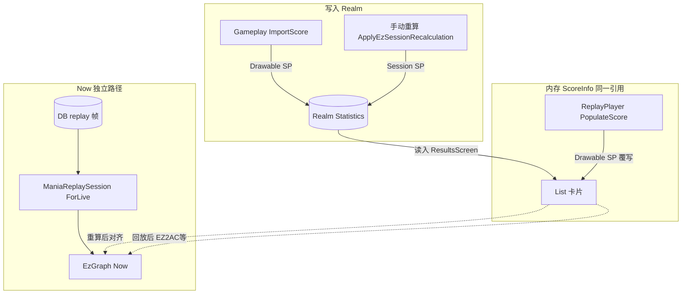

# Mania 成绩数据源注册表（收口版）

> **用途**：本文件为 Mania 拓展成绩分析 / 结算 list / 重算 / 回放 **数据源与产品语义的唯一人工维护准则**。  
> 后续分析、改代码、写测试 **以本表为准**；与旧对话结论冲突时，以本表 + 代码为准。  
> **创建日期**：2026-07-12  
> **状态**：初稿，待用户手工纠正标记。

---

## 1. 参考文档阅读确认

| 文档                            | 路径                                                                                                      | 本次是否完整读过        |
|-------------------------------|---------------------------------------------------------------------------------------------------------|-----------------|
| ✎ \| Mania Session 黄金标准       | ✎ \| [`REPLAY_JUDGE_MERGE.md`](../../osu.Game.Rulesets.Mania/EzMania/ReplayJudge/REPLAY_JUDGE_MERGE.md) | ✎ \| **是**（本对话） |
| ✎ \| Osu / Catch / Taiko 影子判定 | ✎ \| [`REPLAY_JUDGE_SHADOW.md`](./REPLAY_JUDGE_SHADOW.md)                                               | ✎ \| **是**（本对话） |
| ✎ \| Osu Session              | ✎ \| [`Osu REPLAY_JUDGE_MERGE.md`](../../osu.Game.Rulesets.Osu/EzOsu/ReplayJudge/REPLAY_JUDGE_MERGE.md) | ✎ \| **是**（本对话） |
| ✎ \| Session/Timeline 注册表     | ✎ \| [`EZ-SR-TL-REGISTRY.md`](./EZ-SR-TL-REGISTRY.md)                                                   | ✎ \| **是**（本对话） |

**说明**：✎ \| 上述参考 MD 若与本 MD 有偏差，以 **本 MD + 代码** 为准，并应回头修改参考 MD 对齐。

---

## 2. 单元格标记符号

**规则**：表格中 **每一个单元格** 独立标记；同一行内可 ⛔/✎/❓ 混用。改某一格时 **只改该格**，勿假设整行同对同错。

| 符号  | 含义              | 谁改           |
|-----|-----------------|--------------|
| `⛔` | 不可改 — 产品/架构原则   | 仅你           |
| `✎` | 可改 — 实现细节、路径、条件 | AI / 你       |
| `❓` | 待确认 — 需实测或你对照代码 | 你确认后改为 ⛔ 或 ✎ |

**格式**：`符号 | 内容`（竖线后为空格 + 正文）

---

## 3. 顶级原则（集中）

| 原则（每格独立标记）                                                                                                                                                           |
|----------------------------------------------------------------------------------------------------------------------------------------------------------------------|
| ⛔ \| **Gameplay 入库** = 当场 `ScoreProcessor.PopulateScore`，**不**经 `ManiaReplaySession`。                                                                                |
| ⛔ \| **手动「成绩重算」** = 唯一产品层 Session → 写 Realm（`Statistics` / `StatisticsJson` / `HitEvents` 等）。                                                                        |
| ⛔ \| **数据展示位置的简称** = 均同时包含 TotalScore、Acc、HitResult计数。不允许出现  三个属性各自取 不同源或新旧值 拼接。                                                                                     |
| ⛔ \| **Now（EzGraph）** = 对 DB 中 **replay 帧**，叠加ManiaOffset后，跑 `ManiaReplaySession`（ForLive），**不**读 Statistics 数字。                                                     |
| ⛔ \| **禁止**用 UI 展示层过滤/折算（如 `ManiaHitModeCatalog.GetStatisticsForDisplay` 接线）掩盖 Statistics 真差异。                                                                       |
| ⛔ \| **禁止**入库前 Session 同步（`EzManiaScoreImportSync` 已删，不得恢复）。                                                                                                         |
| ⛔ \| **HitEvents 不持久化**（`ScoreInfo.HitEvents` 带 `[Ignored]`）。                                                                                                        |
| ⛔ \| 进拓展分析前，若 HitEvents 为空，常需 Session **补 HitEvents**（不写 Statistics），不带Offset。                                                                                       |
| ⛔ \| **StatisticsPanel / Graph 默认禁止 silent 写回 Realm Statistics**；例外仅 **用户显式重算**。                                                                                     |
| ⛔ \| **判定 parity 黄金标准（设计）**：同 score + 同 environment 下，Drawable/ReplayPlayer 一遍 `ScoreProcessor` ≡ `ManiaReplaySession.Run`。                                          |
| ⛔ \| **list 卡片**读 Realm `ScoreInfo.Statistics` / Accuracy / TotalScore。                                                                                              |
| ⛔ \| list 经 `GetStatisticsForDisplay()` **根据realm-score的hitmode切换HitResult列表行过滤/命名**，**不改 Statistics 字典计数**。                                                         |
| ⛔ \| 观看回放 **不写 Realm**（除非再次手动重算）。                                                                                                                                    |
| ✎ \| **观看回放后**同一 `ScoreInfo` 引用会被 `PopulateScore` **覆写**为 Drawable 统计。                                                                                               |
| ⛔ \| 在ScoreInfo中，HitMode/HealthMode 双Lazer 等于双为空。举例场景：重算成绩时，如果ScoreInfo中HitMode/HealthMode为空，则视为双Lazer，且重写realm时依然保持HM/HM为空。并且，重算成绩如果发现ScoreInfo HM/HM是双lazer，也要改成双空 |
| ❓ \| 重算后直接进入：**list ≈ Now**（你已测，offset=0）。                                                                                                                           |
| ❓ \| 观看回放后：**list = Drawable**，**Now 不变**；EZ2AC/Malody_E/O2Jam 下 **list ≠ Now**。                                                                                     |
| ❓ \| 上述分叉根因 = **Drawable ≠ Session**，**不是** Now 误读 Realm。                                                                                                            |

---

## 4. 环境解析（Purpose / HitMode / Offset）

> ✎ \| API 名以当前代码为准：`Ez2ConfigManager.ResolveEnvironment`（旧文档 `ResolveForSession` 为历史称法）。

| 字段                            | ForStored                                  | ForLive                                             | Drawable 本地玩            | Drawable 回放                                                  |
|-------------------------------|--------------------------------------------|-----------------------------------------------------|-------------------------|--------------------------------------------------------------|
| ⛔ \| HitMode                  | ⛔ \| `ScoreInfo.ManiaHitMode` 嵌入；无则 Lazer  | ⛔ \| 当前全局 `Ez2Setting.ManiaHitMode`                 | ⛔ \| 开局冻结全局             | ⛔ \| `ResolveEnvironment(ForLive, score, ignoreOffset:true)` |
| ⛔ \| HealthMode               | ⛔ \| 嵌入；无则 Lazer                           | ⛔ \| 当前全局                                           | ⛔ \| 开局冻结               | ⛔ \| 同上                                                      |
| ⛔ \| JudgePrecedence          | ⛔ \| 当前全局                                  | ⛔ \| 当前全局                                           | ⛔ \| 当前全局               | ⛔ \| 当前全局                                                    |
| ⛔ \| BmsPoorHitResultEnable   | ⛔ \| 当前全局                                  | ⛔ \| 当前全局                                           | ⛔ \| 当前全局               | ⛔ \| 当前全局                                                    |
| ⛔ \| OffsetPlusMania（Session） | ⛔ \| **0**                                 | ⛔ \| **0**（`ignoreOffset:true`）                     | ⛔ \| **全局 offset** 参与判定 | ⛔ \| **0**（`ignoreOffset:true`）                              |
| ⛔ \| Graph Now 额外             | ⛔ \| —                                     | ⛔ \| `IncludeGlobalManiaOffset=true` 时可 frame shift | ✎ \| —                  | ✎ \| —                                                       |
| ⛔ \| 手动重算 Purpose             | ⛔ \| `ForStored`                           | ⛔ \| `ForLive`                                      | ✎ \| —                  | ✎ \| —                                                       |
| ⛔ \| 重算 vs Graph offset 标志    | ⛔ \| 重算固定 `IncludeGlobalManiaOffset=false` | ⛔ \| Graph 为 `true`                                 | ❓ \| —                  | ❓ \| —                                                       |
| ❓ \| offset≠0 时重算≈Now         | ❓ \| 文档意图应对齐                               | ❓ \| 代码可能分叉                                         | ❓ \| —                  | ❓ \| —                                                       |

**代码锚点**：✎ \| [`Ez2ConfigManager.ResolveEnvironment`](../../osu.Game/EzOsuGame/Configuration/Ez2ConfigManager.cs) · ✎ \| [`EzReplaySession.ResolveEnvironment`](./EzReplaySession.cs) · ✎ \| [`DrawableManiaRuleset.LoadComplete`](../../osu.Game.Rulesets.Mania/UI/DrawableManiaRuleset.cs)

---

## 5. 数据源矩阵（主表）

列说明（无标记，仅图例）：

- **展示位置** · **Statistics/Acc/Score** · **HitEvents** · **判定引擎** · **环境** · **触发条件** · **持久化** · **影响** · **与黄金标准**

---

### 5.1 写入 / 仿真路径

| 展示位置 / 代码锚点                                                | Statistics / Acc / Score                        | HitEvents                                | 判定引擎                           | 环境                                                   | 触发条件                           | 持久化                        | 影响                                | 与黄金标准                                    |
|------------------------------------------------------------|-------------------------------------------------|------------------------------------------|--------------------------------|------------------------------------------------------|--------------------------------|----------------------------|-----------------------------------|------------------------------------------|
| ⛔ \| Gameplay 入库 ✎ \| `Player.ImportScore`              | ⛔ \| 当场 `ScoreProcessor.PopulateScore`          | ✎ \| 同次 SP 内存 HitEvents                  | ⛔ \| **Drawable**              | ✎ \| 开局冻结 ForLive                                    | ✎ \| 本地打完                      | ⛔ \| 非 ReplayPlayer        | ⛔ \| 写 Realm Statistics/Acc/Score | ✎ \| **不写** HitEvents 到 Realm            | ✎ \| 新成绩 list；Graph Original 基准 | ⛔ \| 当场游玩参考实现 |
| ⛔ \| ReplayPlayer 回放 ✎ \| `Player` + `ReplayPlayer`     | ⛔ \| 回放 SP → `PopulateScore` → **内存 ScoreInfo** | ✎ \| 同次 SP                               | ⛔ \| **Drawable**              | ✎ \| `ColumnRoutesInput=true`，与本地游玩/Session 同列路由 | ⛔ \| ForLive + ignoreOffset    | ✎ \| 点「观看回放」或 replay 结束进结算 | ⛔ \| **不写 Realm**（ImportScore 跳过） | ⛔ \| **覆写** ResultsScreen 的 ScoreInfo 引用 | ⛔ \| list 变为 Drawable 统计 | ⛔ \| parity 对照方（设计） |
| ⛔ \| 手动重算（ForStored） ✎ \| `EzScoreRecalculationService` | ⛔ \| Session → `ApplyEzSessionRecalculation`    | ✎ \| Session 产出                          | ⛔ \| **ManiaReplaySession**    | ⛔ \| ForStored：嵌入 HM/HM （无嵌入时，则默认视为双Lazer，且不覆写HM/HM） | ✎ \| ForStored：ScoreInfo HM/HM | ⛔ \| offset=0（重算路径）        | ✎ \| 选歌「原始环境重算」                   | ⛔ \| **写 Realm** + detached ScoreInfo    | ✎ \| list / hover / Original | ❓ \| Session **应 ≡ Drawable**（同 env） |
| ⛔ \| 手动重算 （ForLive） ✎ \| `EzScoreRecalculationService`  | ⛔ \| Session → `ApplyEzSessionRecalculation`    | ✎ \| Session 产出                          | ⛔ \| **ManiaReplaySession**    | ✎ \| ForStored：嵌入 HM/HM                              | ✎ \| ForLive：全局 HM/HM          | ⛔ \| offset=0（重算路径）        | ✎ \| 选歌「当前环境重算」                   | ⛔ \| **写 Realm** + detached ScoreInfo    | ✎ \| list / hover / Original | ❓ \| Session **应 ≡ Drawable**（同 env） |
| ✎ \| `ManiaReplaySession.Run`                              | ✎ \| SP `PopulateScore` 输出                      | ✎ \| 同次 SP                               | ✎ \| ColumnSimulator + Mapping | ✎ \| 调用方传入 environment                               | ✎ \| 重算 / Graph Now / 测试       | ✎ \| 仅经 ApplyEz 写库         | ✎ \| Now、parity                   | ✎ \| Session 侧标准                         |
| ✎ \| `ManiaScoreHitEventGenerator`                         | ✎ \| 不产出 Statistics                             | ✎ \| `RunHitEventsAsync`                 | ✎ \| Session                   | ⛔ \| 默认 Purpose=**ForLive**                          | ✎ \| Graph 帧量化修复               | ✎ \| 无                     | ✎ \| OriginalHitEvents 覆盖         | ✎ \| 薄壳，非参考实现                            |
| ✎ \| StatisticsPanel 补 HitEvents                           | ⛔ \| **不 patch Statistics**                     | ✎ \| `RunHitEventsAsync(..., ForStored)` | ✎ \| Session                   | ✎ \| ForStored                                       | ✎ \| HitEvents 空且有 replay      | ✎ \| 仅内存 patch HitEvents   | ✎ \| 拓展子项可用                       | ✎ \| Statistics 仍读 ScoreInfo             |

---

### 5.2 读取 / 展示路径

| 展示位置 / 代码锚点                                                           | Statistics / Acc / Score                         | HitEvents                      | 判定引擎                        | 环境                                           | 触发条件                                 | 持久化                           | 影响                               | 与黄金标准                   |
|-----------------------------------------------------------------------|--------------------------------------------------|--------------------------------|-----------------------------|----------------------------------------------|--------------------------------------|-------------------------------|----------------------------------|-------------------------|
| ✎ \| 结算 list Expanded/Contracted ✎ \| `ExpandedPanelMiddleContent` | ✎ \| Realm/内存 Statistics 等                       | ✎ \| 不直接显示                     | ⛔ \| **无重算**                | ✎ \| `GetStatisticsForDisplay(score)` 经 ManiaRuleset 覆写 | ✎ \| 嵌入 HitMode 过滤/命名；无嵌入按 Lazer | ✎ \| 进 ResultsScreen          | ✎ \| 回放后引用被覆写                    | ✎ \| 读 Realm 或内存        | ✎ \| 卡片 Perfect/Miss | ✎ \| 纯展示；不改 Statistics 计数 |
| ✎ \| 选歌 hover Tooltip ✎ \| `BeatmapLeaderboardScore.Tooltip`       | ✎ \| Realm/内存 Statistics                         | ⛔ \| 无                         | ⛔ \| 无                      | ⛔ \| 同 list                                  | ⛔ \| hover                           | ⛔ \| 读                        | ✎ \| Tooltip 判定行                 | ✎ \| 同 list             |
| ⛔ \| EzGraph Original 数字 ✎ \| `EzScoreGraphMania` 构造               | ⛔ \| 构造时 ScoreInfo 快照 Acc/Score/Statistics       | ✎ \| `score.HitEvents` 或 不直接显示 | ⛔ \| 无（读快照）                 | ⛔ \| 进入面板时 ScoreInfo 状态                      | ⛔ \| 打开拓展分析                          | ✎ \| 无                        | ⛔ \| Graph 左列 Original           | ⛔ \| = 进面板时 ScoreInfo   |
| ⛔ \| EzGraph Now 数字 ✎ \| `RefreshFromService`                      | ⛔ \| `CommittedNowScore.ScoreInfo.*` Session Run | ⛔ \| Session HitEvents         | ⛔ \| **ManiaReplaySession** | ⛔ \| ForLive                                 | ⛔ \| `IncludeGlobalManiaOffset=true` | ⛔ \| 开面板/改 HM/offset debounce | ✎ \| 无                           | ⛔ \| Now Acc/Score/计数   | ⛔ \| **不读 Realm 统计** |
| ✎ \| EzGraph Now 输入（这是什么东西？） ✎ \| `ResolveInputScore`              | ✎ \| —                                           | ✎ \| `GetScore` 取 **replay 帧** | ✎ \| —                      | ✎ \| —                                       | ✎ \| 每次 RefreshFromService           | ✎ \| —                        | ✎ \| 与 list 内存 Statistics **解耦** | ✎ \| —                  |
| ✎ \| EzGraph offset 拖动 ✎ \| `RefreshDisplayOnly`                   | ✎ \| Rejudge 预览计数                                | ✎ \| 平移后 HitEvents             | ✎ \| Rejudge 非 Session      | ✎ \| 当前全局 HitMode                            | ✎ \| 拖 offset                        | ✎ \| 无                        | ✎ \| 散点/数字预览                     | ⛔ \| **不是** Session     |
| ⛔ \| EzGraph V1                                                       | ⛔ \| Classic 假想                                  | ⛔ \| GetV1HitEvents            | ⛔ \| HitWindows             | ⛔ \| Classic                                 | ⛔ \| 始终                              | ⛔ \| 无                        | ⛔ \| V1 列                        | ⛔ \| 独立路线               |
| ✎ \| StatisticsPanel 子统计                                              | ✎ \| 读 ScoreInfo                                 | ✎ \| 内存或 ForStored 补           | ✎ \| 各 StatisticItem        | ✎ \| —                                       | ⛔ \| 展开拓展                            | ✎ \| 无                        | ✎ \| 分布图等                        | ✎ \| 依赖 HitEvents       |
| ✎ \| PresentScore Results ✎ \| `OsuGame.PresentScore`              | ✎ \| Realm ScoreInfo                             | ⛔ \| 空则 Panel 补                | ✎ \| —                      | ✎ \| —                                       | ⛔ \| 选歌点成绩                           | ✎ \| 读 Realm                  | ✎ \| list + Original             | ✎ \| 未重算=入库快照           |
| ✎ \| 角逐 ghost Timeline                                                | ✎ \| Timeline 快照分                                | ✎ \| Session RunTimeline       | ⛔ \| Session                | ⛔ \| ForLive offset=0                        | ✎ \| Race HUD                        | ✎ \| cache                    | ✎ \| 实时分轨                        | ⛔ \| 不用终局 TotalScore 冒充 |

---

## 6. abcd 场景对照

> ✎ \| 背景：已手动 **ForLive 重算**；无 LN；offset=0。

| 场景                    | 代号         | list 卡片统计                                | Now（EzGraph）                       | 关系（你的观测）                                      |
|-----------------------|------------|------------------------------------------|------------------------------------|-----------------------------------------------|
| ✎ \| 点成绩进 list（未观看回放） | ✎ \| **a** | ✎ \| 读Realm                              | ✎ \| score frame + Session ForLive | ✎ \| 设计：应一致                                   |
| ✎ \| 拓展分析 Now （未观看回放） | ✎ \| **b** | ✎ \| —                                   | ✎ \| score frame + Session ForLive | ❓ \| **a≈b**（重算后直接进入，你已测）                     |
| ✎ \| 观看回放后进 list      | ✎ \| **c** | ⛔ \| ReplayPlayer Drawable PopulateScore | ✎ \| —                             | ✎ \| **c = gameplay 回放**                      |
| ✎ \| 拓展分析 Now （观看回放后） | ✎ \| **d** | ✎ \| —                                   | ✎ \| score frame + Session（**不变**） | ❓ \| 重算后 **b≈d**                              |
| ❓ \| 回放后分叉            | ✎ \| （补充行） | ✎ \| —                                   | ✎ \| —                             | ❓ \| 回放后 **c≠d**；EZ2AC/Malody_E −1P；O2Jam −3P |

### 6.1 分叉结论（每格独立）

| 结论                                                                  |
|---------------------------------------------------------------------|
| ❓ \| 回放后分叉 **不是** Now 误读 Realm。                                     |
| ❓ \| 回放后分叉 = **Drawable 回放统计 ≠ Session ForLive**（同 replay、同全局 env）。 |
| ❓ \| Lazer / Malody_B 回放后仍对齐 → parity **按 HitMode 选择性** 失败。         |
| ⛔ \| 修复方向：**Session ↔ Drawable parity**。                            |
| ⛔ \| **不是**改 Now 数据源。                                               |
| ⛔ \| **不是** UI 过滤掩盖。                                                |

---

## 7. 写入时序（简图）

✎ \| 下图仅为理解辅助；与 §5 冲突时以 §5 各格标记为准。

---

## 8. 代码与旧文档差异

| 项                         | 旧文档/对话                                          | 当前代码                                                    |
|---------------------------|-------------------------------------------------|---------------------------------------------------------|
| ✎ \| 环境 API 名             | ❓ \| `ResolveForSession` / `ResolveForDrawable` | ✎ \| `ResolveEnvironment(purpose, score, ignoreOffset)` |
| ✎ \| list 展示 HitMode      | ❓ \| 曾接 `ManiaHitModeCatalog`                   | ✎ \| Catalog 已删除；`ScoreInfo.GetStatisticsForDisplay()` 将 score 传给 `ManiaRuleset` 覆写 |
| ✎ \| Generator 默认 Purpose | ❓ \| 文档写 ForStored                              | ❓ \| 默认 **ForLive**；Panel 显式 ForStored                  |
| ❓ \| O2 回放 BPM            | ✎ \| 未文档化                                       | ❓ \| `NotifyO2InputAt` 仅 ColumnRoutesInput 时；回放可能缺 BPM  |
| ❓ \| 重算 vs Graph offset   | ✎ \| REGISTRY 写 offset=0                        | ❓ \| Graph 有 `IncludeGlobalManiaOffset`；重算默认 false      |

---

## 9. 相关测试

| 测试                                   | 断言什么                                     | 覆盖你的 abcd？                       |
|--------------------------------------|------------------------------------------|----------------------------------|
| ✎ \| `TestSceneReplaySessionParity`  | ✎ \| Drawable replay HitEvents ≡ Session | ❓ \| 部分 HitMode；缺 tap 密集 EZ2AC 等 |
| ✎ \| `ManiaCrossSourceInvariantTest` | ✎ \| HitEvents 聚合 ≡ Statistics           | ✎ \| Session 内部                  |
| ✎ \| `ManiaAnalysisParityTest`       | ✎ \| 重算写回 ≡ Now                          | ✎ \| **a≈b** 路径                  |
| ❓ \| **缺失**                          | ❓ \| ForLive 重算 → 观看回放 → **c vs d**      | ⛔ \| **未覆盖**                     |

---

## 10. 维护约定

| 约定                                         |
|--------------------------------------------|
| ⛔ \| 改数据源 / 写回 / Now 语义前 **先改本表对应格**，再改代码。 |
| ✎ \| 代码变更后只更新受影响的 **✎ 格**，勿动你已标 ⛔ 的格。      |
| ⛔ \| AI 不得凭旧对话「统计一致」跳过 parity 测试。          |
| ✎ \| 一行内 ⛔ 与 ❓ 并存时，以 **❓ 格实测** 为准决定是否升 ⛔。  |

---

## 11. 变更记录

| 日期              | 说明                             |
|-----------------|--------------------------------|
| ✎ \| 2026-07-12 | ✎ \| 初稿；纠正「Now 读 Realm」误述      |
| ✎ \| 2026-07-12 | ✎ \| 改为 **每单元格独立标记**，删除整行「标记」列 |
| ✎ \| 2026-07-12 | ✎ \| 删除死代码 Catalog；list 改由 ManiaRuleset 按 score 嵌入 HitMode 展示 |
| ✎ \| 2026-07-12 | ✎ \| ReplayPlayer 启用列路由；补 EZ2AC/Malody_E/O2 与重算后 c/d parity 测试 |
