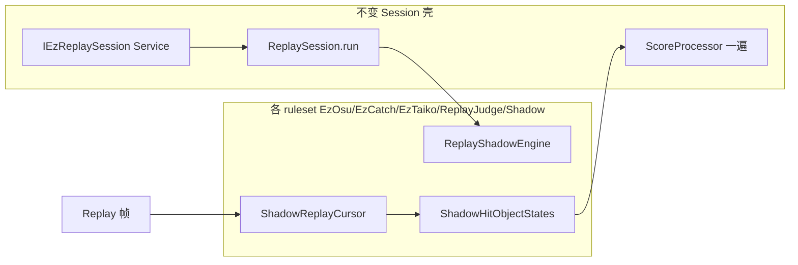

# Replay Shadow Judgement（Osu / Catch / Taiko 统一思路）

Ez2Lazer 在 **Mania 以外** 的三模式（Osu、Catch、Taiko）共用本设计；**不**引入 Mania 式 HitMode / Strategy 双轨，**不**破坏各 ruleset 既有 Drawable / 元判定机制。

相关：

- 框架注册表：[EZ-SR-TL-REGISTRY.md](./EZ-SR-TL-REGISTRY.md)
- Mania（独立路径）：[`REPLAY_JUDGE_MERGE.md`](../../osu.Game.Rulesets.Mania/EzMania/ReplayJudge/REPLAY_JUDGE_MERGE.md)
- Osu 落地：[REPLAY_JUDGE_MERGE.md](../../osu.Game.Rulesets.Osu/EzOsu/ReplayJudge/REPLAY_JUDGE_MERGE.md) · **OSL-010**

---

## 1. 为什么不用 Mania 那套

| | Mania | Osu / Catch / Taiko |
|---|--------|---------------------|
| 模式切换 | 多种 Ez HitMode，需 Registry + Replica | **无** HitMode 切换需求 |
| 判定源 | ColumnSimulator + Mapping 与 Drawable 双轨对齐 | **单一**官方判定语义（ppy Drawable） |
| Session 目标 | 抽离 HitMode 判定到共享 Mapping | **影子复刻** Drawable 状态机，不拆元机制 |

---

## 2. 影子判定（Shadow Judgement）定义

**影子判定** = 无绘制、按 replay 时钟推进，维护与 Drawable/ReplayPlayer **等价的逻辑状态**，在正确时刻向 `ScoreProcessor.ApplyResult` 喂入 `JudgementResult`。

**禁止**：

- 生产路径 HeadlessGameHost 跑完整 `DrawableRuleset`（过重）
- 第二遍 HitEvents → SP（F 类）
- 为 Session 单独维护与 Drawable 无关的 press 启发式（OSL-010 完成后）

**允许**：

- 首版在 Ez 侧移植 Drawable 判定段落；parity 绿后，将纯函数提取到 `Rulesets.*` 小 helper，Drawable 改一行调用（非行为变更）

---

## 3. 三模式统一分层

| 层级 | 职责 | Osu | Catch / Taiko |
|------|------|-----|----------------|
| `EzOsuGame/Scoring` | `IEzReplaySession`、Timeline、Race、cache | ✓ | 远期同形 |
| `Rulesets.*/Ez*/ReplayJudge/` | `*ReplaySession` / Service | OSL-007 **done** | 后继 epic（前缀待定） |
| `.../ReplayJudge/Shadow/` | Cursor + Engine + 各对象 ShadowState | **OSL-010 进行中** | 参考 Osu，不复制 Mania Mapping |
| `*ScoreHitEventGenerator` | 薄壳委托 Service | **done** | 同 Mania/Osu |

各 mode 的 Shadow 模块命名一致：

- `{Mode}ShadowReplayCursor` — replay 插值 + 按键边沿
- `{Mode}ReplayShadowEngine` — 时钟主循环 → ApplyResult
- `{Mode}Shadow{Object}State` — circle/fruit/drum 等对象状态机

**环境**：Osu/Catch/Taiko Session **不**读 `ManiaHitMode` / `JudgePrecedence` 的 Mania 专用分支；仅 `ReplayRunPurpose` + mods + beatmap。

---

## 4. 黄金标准（三模式相同）

> 同一 score + 同一 environment 下，`ReplaySession.Run` 的 **HitEvents + Score** 必须与 ReplayPlayer 一遍后 `ScoreProcessor` 字段级一致。

Parity 测试：各 ruleset 的 `TestScene*ReplaySessionParity`（Drawable replay vs Session）。

---

## 5. 实施顺序

| 阶段 | Ruleset | 注册 ID | 内容 |
|------|---------|---------|------|
| **done** | Osu | OSL-007~009 | Session 壳 + Builder/Generator 接线 |
| **进行中** | Osu | **OSL-010** | Shadow 引擎；S1 Circle → S2 Slider → S3 Spinner → S4 Parity |
| **远期** | Catch | TSL-* 或 OSL 后继 | 复用 Shadow 分层；fruit/catch movement |
| **远期** | Taiko | TTL-* 或 OSL 后继 | 复用 Shadow 分层；don/kat drum |

Catch/Taiko **不**在 OSL-010 内实现；Osu Shadow 验证后再开独立前缀条目。

---

## 6. OSL-010 子阶段（Osu）

| PR | 内容 |
|----|------|
| S0 | 本文 + Osu REPLAY_JUDGE_MERGE + REGISTRY |
| S1 | `OsuShadowReplayCursor` + Circle + Engine 骨架；删 Simulator press 循环 |
| S2 | `ShadowSliderState` |
| S3 | `ShadowSpinnerState` |
| S4 | `TestSceneOsuReplaySessionParity`；OSL-010 → done |

估时：约 3–5 人周（Slider 为主风险）。
